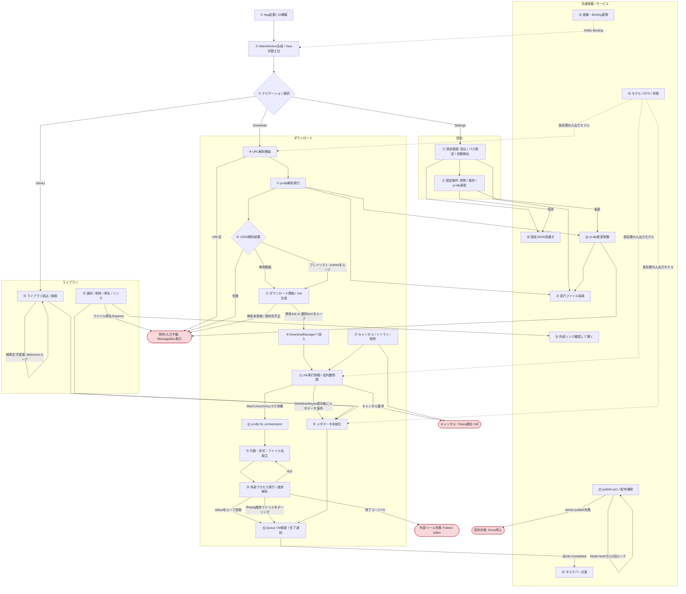
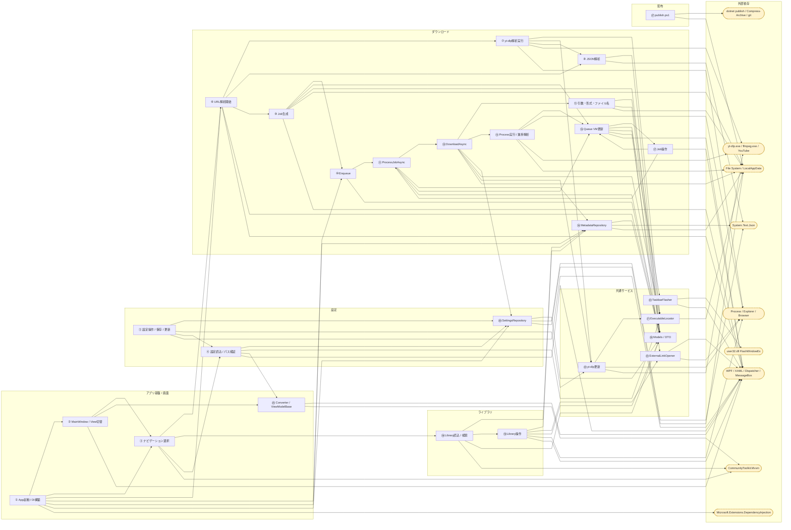

# YouTubeDownloader プロジェクト全体処理 3段階理解

作成日: 2026-06-14

この資料は、実行時のアプリ処理を中心に、設定、ライブラリ管理、外部ツール連携、配布スクリプトまでを3段階で整理したものです。コード上のコメントやREADMEには一部文字化けがありますが、ここでは実装の制御フローを基準に説明します。

## 第1段階: 全体俯瞰のフローチャート

## 第2段階: 関数単位の詳細説明

### ① App起動 / DI構築

対象ファイル: `YouTubeDownloader/App.xaml.cs`, `YouTubeDownloader/YouTubeDownloader.csproj`

対象関数:

- `App()`
  - 役割: WPFアプリ起動時にDIコンテナを作り、アプリ全体のサービス構成を初期化する。
  - 入力: なし
  - 出力: `App` インスタンス
  - 処理の流れ:
    - `ServiceCollection` を生成する。
    - `ConfigureServices(services)` を呼び出す。
    - `BuildServiceProvider()` で `_serviceProvider` を保持する。
  - 分岐・例外時の挙動:
    - サービス登録自体に例外処理はなく、構築失敗時はWPF起動処理が例外で止まる。

- `ConfigureServices(IServiceCollection services)`
  - 役割: Repository、Service、ViewModel、MainWindowを登録する。
  - 入力: `IServiceCollection services`
  - 出力: `void`
  - 処理の流れ:
    - `ISettingsRepository` と `IMetadataRepository` をSingleton登録する。
    - `IYtDlpClient` と `IDownloadManager` をSingleton登録する。
    - `DownloadViewModel`, `LibraryViewModel`, `SettingsViewModel` をTransient登録する。
    - `MainWindowViewModel` は各ViewModel factoryを受け取るSingletonとして登録する。
    - `MainWindow` をSingleton登録する。
  - 分岐・例外時の挙動:
    - 明示分岐はない。未登録依存がある場合は解決時に例外になる。

- `OnStartup(StartupEventArgs e)`
  - 役割: DIから `MainWindow` を取り出して表示する。
  - 入力: `StartupEventArgs e`
  - 出力: `void`
  - 処理の流れ:
    - `base.OnStartup(e)` を呼ぶ。
    - `_serviceProvider.GetRequiredService<MainWindow>()` でMainWindowを解決する。
    - `mainWindow.Show()` を実行する。
  - 分岐・例外時の挙動:
    - `MainWindow` 解決失敗時は例外でアプリ起動が停止する。

- `CopyBuildOutputToConfiguredFolder` MSBuild Target
  - 役割: 通常ビルド後に `PostBuildCopyOutputDir` へ出力物をコピーする。
  - 入力: `$(TargetDir)`, `$(PostBuildCopyOutputDir)`
  - 出力: コピー済みファイル群
  - 処理の流れ:
    - `AfterTargets="Build"` で実行される。
    - 出力先ディレクトリを作成する。
    - `$(TargetDir)` 以下のファイルを設定先へコピーする。
  - 分岐・例外時の挙動:
    - `PostBuildCopyOutputDir` が空、または `TargetDir` が存在しない場合は実行されない。

### ② MainWindow生成 / View切替土台

対象ファイル: `YouTubeDownloader/MainWindow.xaml.cs`, `YouTubeDownloader/MainWindow.xaml`, `YouTubeDownloader/Views/*.xaml.cs`

対象関数:

- `MainWindow(MainWindowViewModel viewModel)`
  - 役割: メインウィンドウを初期化し、ViewModelをDataContextへ接続する。
  - 入力: `MainWindowViewModel viewModel`
  - 出力: `MainWindow` インスタンス
  - 処理の流れ:
    - `InitializeComponent()` でXAMLを読み込む。
    - `DataContext = viewModel` を設定する。
  - 分岐・例外時の挙動:
    - XAML読み込み失敗やBindingエラーはWPF側で発生する。

- `DownloadView()`, `LibraryView()`, `SettingsView()`
  - 役割: 各UserControlのXAMLを初期化する。
  - 入力: なし
  - 出力: 各 `UserControl` インスタンス
  - 処理の流れ:
    - `InitializeComponent()` を呼ぶ。
    - `MainWindow.xaml` の `DataTemplate` により `CurrentView` の型に応じて表示される。
  - 分岐・例外時の挙動:
    - 明示分岐はない。

### ③ ナビゲーション選択

対象ファイル: `YouTubeDownloader/ViewModels/MainWindowViewModel.cs`

対象関数:

- `MainWindowViewModel(Func<DownloadViewModel>, Func<LibraryViewModel>, Func<SettingsViewModel>)`
  - 役割: 画面遷移用のfactoryを保持し、初期画面をダウンロード画面にする。
  - 入力: `Func<DownloadViewModel>`, `Func<LibraryViewModel>`, `Func<SettingsViewModel>`
  - 出力: `MainWindowViewModel` インスタンス
  - 処理の流れ:
    - factoryをフィールドへ保存する。
    - `DownloadViewModel` を生成する。
    - `CurrentView` にダウンロード画面VMを設定する。
  - 分岐・例外時の挙動:
    - factory解決に失敗すると例外になる。

- `NavigateToDownload()`, `NavigateToLibraryAsync()`, `NavigateToSettings()`
  - 役割: XAMLのナビゲーション操作から画面切替を開始する。
  - 入力: なし
  - 出力: `void` または `Task`
  - 処理の流れ:
    - 対応する `NavigationItem` を `ApplyNavigationAsync` へ渡す。
    - Libraryのみ `await` して読み込み完了を待つ。
  - 分岐・例外時の挙動:
    - Download/Settingsはfire-and-forgetで、内部例外は呼び出し元に返らない。

- `OnSelectedNavigationChanged(NavigationItem value)`
  - 役割: RadioButton Bindingで選択値が変わった場合にナビゲーションを同期する。
  - 入力: `NavigationItem value`
  - 出力: `void`
  - 処理の流れ:
    - `_isSyncingSelectedNavigation` がtrueなら再入を避けて戻る。
    - `ApplyNavigationAsync(value)` を呼ぶ。
  - 分岐・例外時の挙動:
    - 同期中は何もしない。

- `ApplyNavigationAsync(NavigationItem navigation)`
  - 役割: 選択状態と表示ViewModelを一致させる。
  - 入力: `NavigationItem navigation`
  - 出力: `Task`
  - 処理の流れ:
    - `SelectedNavigation` と引数が異なる場合、再入抑止フラグを立てて同期する。
    - Downloadなら `DownloadViewModel` を遅延生成し `CurrentView` へ設定する。
    - Libraryなら `LibraryViewModel` を遅延生成し `LoadAsync()` を実行する。
    - Settingsなら `SettingsViewModel` を遅延生成し `CurrentView` へ設定する。
  - 分岐・例外時の挙動:
    - 未定義の `NavigationItem` はswitchのどれにも入らず何もしない。
    - Library読み込み中の例外は呼び出し元のTaskへ伝播する。

### ④ 設定画面: 読込 / パス検証 / 自動検出

対象ファイル: `YouTubeDownloader/ViewModels/SettingsViewModel.cs`

対象関数:

- `SettingsViewModel(ISettingsRepository settingsRepository, IYtDlpClient ytDlpClient)`
  - 役割: 設定画面VMを生成し、保存済み設定を画面へ反映する。
  - 入力: `ISettingsRepository settingsRepository`, `IYtDlpClient ytDlpClient`
  - 出力: `SettingsViewModel` インスタンス
  - 処理の流れ:
    - 依存Repository/Clientを保存する。
    - `LoadSettings()` を実行する。
  - 分岐・例外時の挙動:
    - 設定読込失敗時はRepository側でデフォルト設定へフォールバックする。

- `LoadSettings()`
  - 役割: 設定JSONから値を読み、画面プロパティへ展開する。
  - 入力: なし
  - 出力: `void`
  - 処理の流れ:
    - `_settingsRepository.Load()` を呼ぶ。
    - yt-dlp/ffmpegパス、既定保存先、形式、品質、言語、ファイル名テンプレートを反映する。
    - `ValidatePaths()` でパス状態を更新する。
    - 自動更新メッセージとファイル名プレビューを更新する。
  - 分岐・例外時の挙動:
    - 音声品質などは `NormalizeSelection` で候補外ならfallbackへ戻す。

- `ValidatePaths()`
  - 役割: 手入力された実行ファイルパスの有効性を判定し、自動検出も走らせる。
  - 入力: なし
  - 出力: `void`
  - 処理の流れ:
    - `File.Exists(YtDlpPath)` と `File.Exists(FfmpegPath)` を評価する。
    - `AutoDetectPaths()` を呼び、手入力が無効でも自動検出できれば有効扱いにする。
  - 分岐・例外時の挙動:
    - 空文字や存在しないパスはfalseになる。

- `AutoDetectPaths()`
  - 役割: `ExecutableLocator` で yt-dlp / ffmpeg を探索し、画面表示を更新する。
  - 入力: なし
  - 出力: `void`
  - 処理の流れ:
    - `ExecutableLocator.FindExecutable("yt-dlp.exe", "yt-dlp")` を呼ぶ。
    - 見つかった場合は `YtDlpAutoDetected` と `IsYtDlpValid` を更新する。
    - ffmpegも同じ手順で探索する。
  - 分岐・例外時の挙動:
    - 見つからない場合は「見つからない」旨の表示文字列にする。

- `CanUpdateYtDlp()`
  - 役割: yt-dlp更新ボタンの実行可否を返す。
  - 入力: なし
  - 出力: `bool`
  - 処理の流れ:
    - `!IsUpdatingYtDlp && IsYtDlpValid` を返す。
  - 分岐・例外時の挙動:
    - 更新中またはyt-dlp未検出ならfalse。

- `UpdateFilenamePreview()`
  - 役割: ファイル名テンプレートのサンプル表示を作る。
  - 入力: なし
  - 出力: `void`
  - 処理の流れ:
    - `{title}`, `{channel}`, `{id}`, `{index}`, `{index:02d}` をサンプル値へ置換する。
    - `.mp4` を付けて `FilenamePreview` に設定する。
  - 分岐・例外時の挙動:
    - 明示分岐はない。

- `NormalizeSelection(string? value, string[] candidates, string fallback)`
  - 役割: 保存値が現在の候補に含まれるか検証する。
  - 入力: `string? value`, `string[] candidates`, `string fallback`
  - 出力: `string`
  - 処理の流れ:
    - 空でなく候補に含まれる場合は `value` を返す。
    - それ以外は `fallback` を返す。
  - 分岐・例外時の挙動:
    - 候補外の古い設定値を安全に既定へ戻す。

### ⑤ 設定操作: 参照 / 保存 / yt-dlp更新

対象ファイル: `YouTubeDownloader/ViewModels/SettingsViewModel.cs`

対象関数:

- `BrowseYtDlpPath()`, `BrowseFfmpegPath()`
  - 役割: ファイル選択ダイアログから実行ファイルパスを設定する。
  - 入力: なし
  - 出力: `void`
  - 処理の流れ:
    - `OpenFileDialog` を表示する。
    - OKなら選択パスをプロパティに入れる。
    - `ValidatePaths()` を実行する。
  - 分岐・例外時の挙動:
    - キャンセル時は何もしない。

- `BrowseDefaultSaveFolder()`
  - 役割: フォルダ選択ダイアログで既定保存先を設定する。
  - 入力: なし
  - 出力: `void`
  - 処理の流れ:
    - `OpenFolderDialog` を表示する。
    - OKなら `DefaultSaveFolder` を更新する。
  - 分岐・例外時の挙動:
    - キャンセル時は何もしない。

- `SaveSettingsAsync()`
  - 役割: 画面入力を `AppSettings` へ反映してJSON保存する。
  - 入力: なし
  - 出力: `Task`
  - 処理の流れ:
    - パス、自動更新、言語、既定保存先、形式、品質、AV1優先、ファイル名テンプレートを `_settings` に代入する。
    - `_settingsRepository.SaveAsync(_settings)` を呼ぶ。
    - 保存完了のMessageBoxを表示する。
  - 分岐・例外時の挙動:
    - 言語が空白なら `"ja"` を保存する。
    - 保存失敗時の明示catchはないため例外がUIコマンドへ伝播する。

- `UpdateYtDlpAsync()`
  - 役割: 設定画面から手動で `yt-dlp -U` を実行する。
  - 入力: なし
  - 出力: `Task`
  - 処理の流れ:
    - `IsUpdatingYtDlp = true` にする。
    - `_ytDlpClient.UpdateYtDlpAsync()` を呼ぶ。
    - 結果メッセージを `YtDlpUpdateStatus` に反映する。
    - `ValidatePaths()` で状態を再評価する。
  - 分岐・例外時の挙動:
    - `CanUpdateYtDlp()` がfalseならコマンドは実行不可。
    - 更新失敗結果なら `Output` または `Message` をMessageBoxで表示する。
    - 例外時は失敗メッセージを表示し、finallyで `IsUpdatingYtDlp` をfalseへ戻す。

- `OnFilenameTemplateChanged(string value)`, `OnAutoUpdateYtDlpChanged(bool value)`
  - 役割: 設定値変更に応じてプレビューやステータスメッセージを更新する。
  - 入力: `string value` または `bool value`
  - 出力: `void`
  - 処理の流れ:
    - ファイル名テンプレート変更時は `UpdateFilenamePreview()` を呼ぶ。
    - 自動更新設定変更時は表示文言を更新する。
  - 分岐・例外時の挙動:
    - 自動更新がtrue/falseでメッセージを切り替える。

### ⑥ ダウンロード画面: URL解析開始

対象ファイル: `YouTubeDownloader/ViewModels/DownloadViewModel.cs`

対象関数:

- `DownloadViewModel(IYtDlpClient, IDownloadManager, ISettingsRepository)`
  - 役割: ダウンロード画面VMを初期化し、設定と既存キューを画面へ復元する。
  - 入力: `IYtDlpClient ytDlpClient`, `IDownloadManager downloadManager`, `ISettingsRepository settingsRepository`
  - 出力: `DownloadViewModel` インスタンス
  - 処理の流れ:
    - 依存サービスを保持する。
    - `DownloadManager` の進捗/状態イベントを購読する。
    - 設定を読み、既定形式・品質・保存先を反映する。
    - `SettingsSaved` を購読し、保存後に既定値を同期できるようにする。
    - `DownloadManager.GetAllJobs()` から既存Jobを `DownloadQueue` に復元する。
  - 分岐・例外時の挙動:
    - 設定読込失敗はRepository側でデフォルトへフォールバックする。

- `AnalyzeAsync()`
  - 役割: 入力URLを解析し、単体動画またはプレイリスト情報をUIへ表示する。
  - 入力: なし。内部状態として `InputUrl` を使う。
  - 出力: `Task`
  - 処理の流れ:
    - URL空白なら警告MessageBoxを表示して終了する。
    - 解析中フラグを立て、前回結果とプレイリスト一覧をクリアする。
    - `_ytDlpClient.AnalyzeUrlAsync(InputUrl)` を実行する。
    - 失敗ならエラーMessageBoxを表示する。
    - 設定変更が保留されていれば `ApplyPendingDefaultsIfNeeded()` で反映する。
    - プレイリストなら `PlaylistItems` に各動画を追加する。
    - 単体動画なら `_currentVideo` と表示情報を設定する。
    - `HasAnalyzedResult = true` にする。
  - 分岐・例外時の挙動:
    - `result.IsPlaylist` でプレイリスト/単体を分岐する。
    - 例外時は「解析エラー」としてMessageBox表示し、finallyで `IsAnalyzing = false` にする。

### ⑦ yt-dlp解析実行

対象ファイル: `YouTubeDownloader/Services/YtDlpClient.cs`

対象関数:

- `YtDlpClient(ISettingsRepository settingsRepository)`
  - 役割: yt-dlp連携クライアントを生成する。
  - 入力: `ISettingsRepository settingsRepository`
  - 出力: `YtDlpClient` インスタンス
  - 処理の流れ:
    - 設定Repositoryを保持する。
  - 分岐・例外時の挙動:
    - なし。

- `AnalyzeUrlAsync(string url, CancellationToken cancellationToken = default)`
  - 役割: yt-dlpを使ってURLのメタデータを取得する。
  - 入力: `string url`, `CancellationToken cancellationToken`
  - 出力: `Task<YtDlpAnalyzeResult>`
  - 処理の流れ:
    - `GetYtDlpPath()` で実行ファイルを探す。
    - `EnsureYtDlpUpdatedAsync(...)` で必要なら自動更新する。
    - 設定からメタデータ取得言語を読み、引数を組み立てる。
    - URLに `list=` または `/playlist` があればプレイリスト候補として `--dump-single-json --flat-playlist` を実行する。
    - プレイリストJSONが取れたら `ParsePlaylistFromJson` を返す。
    - それ以外、またはプレイリスト取得できない場合は `--dump-json --no-playlist` で単体動画解析を行う。
    - `ParseVideoMetadata` 成功時は単体動画の成功結果を返す。
  - 分岐・例外時の挙動:
    - プレイリスト判定でもJSONが空なら単体動画解析へフォールバックする。
    - 解析不能なら `IsSuccess=false` とエラーメッセージを返す。
    - 例外はcatchされ、`YtDlpAnalyzeResult.ErrorMessage` に格納される。

- `RunYtDlpAsync(string ytDlpPath, string arguments, CancellationToken cancellationToken)`
  - 役割: 解析用yt-dlpプロセスを実行し、stdout全体を返す。
  - 入力: `string ytDlpPath`, `string arguments`, `CancellationToken cancellationToken`
  - 出力: `Task<string>`
  - 処理の流れ:
    - `ProcessStartInfo` をUTF-8、stdout/stderrリダイレクトで構築する。
    - プロセスを開始する。
    - stdoutとstderrを最後まで読み取る。
    - プロセス終了を待ち、stdoutを返す。
  - 分岐・例外時の挙動:
    - stderrはデッドロック回避のため読み捨てる。
    - cancellationTokenがキャンセルされると読取/待機がキャンセルされる。

### ⑧ JSON解析結果

対象ファイル: `YouTubeDownloader/Services/YtDlpClient.cs`

対象関数:

- `ParsePlaylistFromJson(string json)`
  - 役割: yt-dlpのプレイリストJSONを `PlaylistMetadata` と動画一覧へ変換する。
  - 入力: `string json`
  - 出力: `YtDlpAnalyzeResult`
  - 処理の流れ:
    - `JsonDocument.Parse(json)` でrootを取得する。
    - playlistのID、タイトル、チャンネル、サムネイルを取得する。
    - `entries` 配列をループし、各entryから `VideoMetadata` を作成する。
    - 動画IDがあれば `https://www.youtube.com/watch?v={id}` のURLを構築する。
    - `PlaylistIndex` を1始まりで付与する。
    - `VideoCount` を設定し、成功結果を返す。
  - 分岐・例外時の挙動:
    - `entries` がない場合は空リストのプレイリストとして返る。
    - JSON解析例外時は `IsSuccess=false` とエラー文を返す。

- `ParseVideoMetadata(string json, string url)`
  - 役割: 単体動画JSONを `VideoMetadata` へ変換する。
  - 入力: `string json`, `string url`
  - 出力: `VideoMetadata?`
  - 処理の流れ:
    - JSON rootを取得する。
    - `upload_date` が `yyyyMMdd` なら `DateTime` へ変換する。
    - ID、タイトル、チャンネル、長さ、公開日、サムネイル、URLを設定する。
  - 分岐・例外時の挙動:
    - `webpage_url` がない場合は引数 `url` を使う。
    - 例外時は `null` を返す。

- `GetStringProperty(JsonElement element, string propertyName)`
  - 役割: JSONオブジェクトからstringプロパティを安全に読む。
  - 入力: `JsonElement element`, `string propertyName`
  - 出力: `string?`
  - 処理の流れ:
    - elementがObjectでなければnull。
    - 指定propertyがStringなら値を返す。
  - 分岐・例外時の挙動:
    - 型不一致や未存在はnull。

- `GetIntProperty(JsonElement element, string propertyName)`
  - 役割: JSONプロパティをintとして安全に読む。
  - 入力: `JsonElement element`, `string propertyName`
  - 出力: `int`
  - 処理の流れ:
    - 数値なら `TryGetInt32`、失敗時はdoubleとして丸める。
    - 文字列ならint、失敗時はdoubleとして解釈する。
  - 分岐・例外時の挙動:
    - Objectでない、未存在、変換不可の場合は0。

- `ToInt32OrDefault(double value)`
  - 役割: doubleを安全にintへ丸める。
  - 入力: `double value`
  - 出力: `int`
  - 処理の流れ:
    - NaN/Infinityなら0。
    - int範囲外なら `int.MaxValue` / `int.MinValue` へ丸める。
    - 範囲内なら四捨五入する。
  - 分岐・例外時の挙動:
    - 異常値を0または範囲端へフォールバックする。

- `GetThumbnailUrl(JsonElement element)`
  - 役割: `thumbnail` または `thumbnails` から代表サムネイルURLを取る。
  - 入力: `JsonElement element`
  - 出力: `string`
  - 処理の流れ:
    - `thumbnail` 文字列があれば優先する。
    - `thumbnails` 配列があれば最大widthのURLを選ぶ。
  - 分岐・例外時の挙動:
    - 取得不可なら空文字。

- `BuildMetadataLanguageArguments(string? language, string? playerClient = null)`
  - 役割: YouTube extractor用の言語/クライアント引数を組み立てる。
  - 入力: `string? language`, `string? playerClient`
  - 出力: `string`
  - 処理の流れ:
    - `NormalizeMetadataLanguage` で言語コードを正規化する。
    - 言語が空でなければ `lang=...` を追加する。
    - playerClientがあれば `player_client=...` を追加する。
    - `--extractor-args "youtube:..."` 形式で返す。
  - 分岐・例外時の挙動:
    - 引数が何もなければ空文字。

- `NormalizeMetadataLanguage(string? language)`
  - 役割: 設定された言語コードをyt-dlpへ渡せる形にする。
  - 入力: `string? language`
  - 出力: `string`
  - 処理の流れ:
    - 空白なら `"ja"`。
    - `"default"` なら空文字。
    - 英数字、`-`, `_` 以外を含む場合は `"ja"`。
  - 分岐・例外時の挙動:
    - 不正文字列は日本語指定へフォールバックする。

### ⑨ ダウンロード開始指示 / Job生成

対象ファイル: `YouTubeDownloader/ViewModels/DownloadViewModel.cs`

対象関数:

- `StartDownload()`
  - 役割: 解析済み情報から `DownloadJob` を作成し、キューへ投入する。
  - 入力: なし。内部状態として解析結果、保存先、選択形式/品質を使う。
  - 出力: `void`
  - 処理の流れ:
    - `HasAnalyzedResult` がfalseなら警告して終了する。
    - 保存先が空なら警告して終了する。
    - `Directory.CreateDirectory(SaveFolderPath)` で保存先を作成/確認する。
    - プレイリストの場合、選択済み `PlaylistItems` を抽出する。
    - 選択項目がなければ警告して終了する。
    - プレイリスト名フォルダを作り、選択項目ごとに `DownloadJob` と `DownloadJobViewModel` を生成する。
    - 単体動画の場合は1つの `DownloadJob` を生成する。
    - `DownloadQueue` にVMを追加し、`_downloadManager.Enqueue(job)` を呼ぶ。
    - 解析結果、URL、プレイリスト表示をリセットする。
  - 分岐・例外時の挙動:
    - 保存先フォルダ作成失敗時はエラーMessageBoxを表示して終了する。
    - プレイリストは選択項目をループ処理する。

- `BrowseSaveFolder()`
  - 役割: ダウンロード保存先を選択する。
  - 入力: なし
  - 出力: `void`
  - 処理の流れ:
    - `OpenFolderDialog` を表示する。
    - OKなら `SaveFolderPath` を更新する。
  - 分岐・例外時の挙動:
    - キャンセル時は何もしない。

- `SelectAllPlaylistItems()`, `ClearAllPlaylistItems()`
  - 役割: プレイリスト内の全項目を選択/解除する。
  - 入力: なし
  - 出力: `void`
  - 処理の流れ:
    - `PlaylistItems` をループし `IsSelected` をtrue/falseにする。
  - 分岐・例外時の挙動:
    - 空リストなら何もしない。

- `OnIsAudioOnlyChanged(bool value)`
  - 役割: 動画/音声のみの切替に合わせて形式と品質の候補を切り替える。
  - 入力: `bool value`
  - 出力: `void`
  - 処理の流れ:
    - 音声のみなら既定音声形式と最後に選んだ音声品質を設定する。
    - 動画なら既定動画形式と最後に選んだ動画品質を設定する。
    - 候補プロパティ変更を通知する。
  - 分岐・例外時の挙動:
    - `value` に応じて音声/動画の既定値を分岐する。

- `OnSelectedQualityChanged(string value)`
  - 役割: 現在選択中の品質を動画/音声別に記憶する。
  - 入力: `string value`
  - 出力: `void`
  - 処理の流れ:
    - `IsAudioOnly` がtrueなら `_lastAudioQuality` を更新する。
    - falseなら `_lastVideoQuality` を更新する。
  - 分岐・例外時の挙動:
    - なし。

- `SanitizeFolderName(string name)`
  - 役割: プレイリストフォルダ名に使えない文字を `_` に置換する。
  - 入力: `string name`
  - 出力: `string`
  - 処理の流れ:
    - `Path.GetInvalidPathChars()` と `Path.GetInvalidFileNameChars()` を結合する。
    - 対象文字をループして置換する。
  - 分岐・例外時の挙動:
    - 入力が空でも空文字のまま返る。

- `LoadDefaultsFrom(AppSettings settings)`, `OnSettingsSaved(object? sender, AppSettings settings)`, `ApplySettings(AppSettings settings)`, `ApplyPendingDefaultsIfNeeded()`
  - 役割: 設定保存後にダウンロード画面の既定値を次回解析タイミングで反映する。
  - 入力: `AppSettings settings`
  - 出力: `void`
  - 処理の流れ:
    - 設定値を候補配列と照合し、既定形式/品質へ保存する。
    - 設定保存イベントが別スレッドならDispatcherへ戻す。
    - `_pendingDefaultsApply` を立てる。
    - 次回解析成功時に `SelectedFormat` / `SelectedQuality` を更新する。
  - 分岐・例外時の挙動:
    - Dispatcherアクセス権がなければ `Dispatcher.Invoke` を使う。
    - `_pendingDefaultsApply` がfalseなら何もしない。

### ⑩ DownloadManagerへ投入

対象ファイル: `YouTubeDownloader/Services/DownloadManager.cs`

対象関数:

- `DownloadManager(IYtDlpClient ytDlpClient, IMetadataRepository metadataRepository)`
  - 役割: ダウンロード管理サービスを初期化する。
  - 入力: `IYtDlpClient ytDlpClient`, `IMetadataRepository metadataRepository`
  - 出力: `DownloadManager` インスタンス
  - 処理の流れ:
    - yt-dlpクライアントとメタデータRepositoryを保持する。
    - `SemaphoreSlim(MaxConcurrency=2)` を生成する。
  - 分岐・例外時の挙動:
    - なし。
  - 補足: 並列数は `AppSettings.MaxConcurrentDownloads` ではなく、クラス内定数 `const int MaxConcurrency = 2` で固定される（設定値は現状未使用）。なお `ConcurrentQueue<DownloadJob> _pendingQueue` も宣言のみで未使用。

- `GetAllJobs()`
  - 役割: 管理中Jobのスナップショットを返す。
  - 入力: なし
  - 出力: `IReadOnlyList<DownloadJob>`
  - 処理の流れ:
    - lock内で `_allJobs.ToArray()` を返す。
  - 分岐・例外時の挙動:
    - lockにより同時更新中でも整合した配列を返す。

- `Enqueue(DownloadJob job)`
  - 役割: Jobを管理一覧へ追加し、非同期処理を開始する。
  - 入力: `DownloadJob job`
  - 出力: `void`
  - 処理の流れ:
    - lock内で `_allJobs` に追加する。
    - `job.Status = Pending` にする。
    - `JobStatusChanged` を発火する。
    - `_ = ProcessJobAsync(job)` でバックグラウンド実行を開始する。
  - 分岐・例外時の挙動:
    - 戻り値でTaskを待たないため、実行中例外は `ProcessJobAsync` 内で状態に変換される。

### ⑪ Job実行制御 / 並列数制限

対象ファイル: `YouTubeDownloader/Services/DownloadManager.cs`

対象関数:

- `ProcessJobAsync(DownloadJob job)`
  - 役割: 1件のダウンロードJobを実行し、状態・進捗・メタデータ保存を管理する。
  - 入力: `DownloadJob job`
  - 出力: `Task`
  - 処理の流れ:
    - `CancellationTokenSource` を作り、Job IDに紐づけて保持する。
    - 既にCanceledならtokenをキャンセルしておく。
    - `_semaphore.WaitAsync(cts.Token)` で同時実行数を最大2に制限する。
    - Jobを `Running` にし、開始時刻・進捗・後処理フラグを初期化する。
    - `Progress<ProgressInfo>` で進捗通知を受け取り、Jobへ反映する。
    - `_ytDlpClient.DownloadAsync(job, progress, cts.Token)` を実行する。
    - 成功時は `Completed`, `Progress=100`, 完了時刻、メタデータのダウンロード日時/形式を更新する。
    - `_metadataRepository.SaveVideoMetadataAsync(...)` で履歴へ保存する。
    - 状態変更イベントを発火する。
  - 分岐・例外時の挙動:
    - `OperationCanceledException` は `Canceled` 状態にする。既にCanceledなら重複通知を避ける。
    - その他例外は `Failed` にし、`ErrorMessage = ex.Message` を入れる。
    - finallyでtoken辞書から削除し、tokenをDisposeし、semaphore取得済みならReleaseする。

### ⑫ yt-dlpダウンロード orchestration

対象ファイル: `YouTubeDownloader/Services/YtDlpClient.cs`

対象関数:

- `DownloadAsync(DownloadJob job, IProgress<ProgressInfo>? progress, CancellationToken cancellationToken = default)`
  - 役割: Jobの内容からyt-dlpダウンロードを実行し、成功時にローカルファイルパスをJobへ反映する。
  - 入力: `DownloadJob job`, `IProgress<ProgressInfo>? progress`, `CancellationToken cancellationToken`
  - 出力: `Task`
  - 処理の流れ:
    - `job.VideoMetadata.Url` が空なら例外を投げる。
    - `GetYtDlpPath()` でyt-dlpを探す。
    - `EnsureYtDlpUpdatedAsync(...)` で必要なら更新する。
    - 設定を読み込む。
    - 保存フォルダを作成する。
    - `BuildFilenameTemplate` と `NormalizeFormat` で出力名と形式を決める。
    - mp3/wavなど変換進捗を取れる場合は一時progressファイルのパスを作る。
    - `BuildDownloadArguments(...)` でyt-dlp引数を作る。
    - `RunDownloadProcessAsync(...)` を実行する。
    - 終了コード0なら `UpdateLocalFilePath(...)` を実行する。
  - 分岐・例外時の挙動:
    - 終了コード非0でstderrに403が含まれる場合はAndroid client指定の引数で一度リトライする。
    - リトライも失敗した場合はstderrを含む例外を投げる。
    - 403以外の失敗も例外を投げる。
    - finallyで変換進捗用一時ファイルを削除する。削除失敗は握りつぶす。

### ⑬ 引数・形式・ファイル名組立

対象ファイル: `YouTubeDownloader/Services/YtDlpClient.cs`

対象関数:

- `BuildDownloadArguments(DownloadJob job, AppSettings settings, string outputPath, string requestedFormat, string? conversionProgressFile = null)`
  - 役割: ダウンロード用yt-dlpコマンドライン引数を生成する。
  - 入力: `DownloadJob job`, `AppSettings settings`, `string outputPath`, `string requestedFormat`, `string? conversionProgressFile`
  - 出力: `string`
  - 処理の流れ:
    - `-o`, `--force-overwrites`, metadata言語指定を追加する。
    - 音声形式なら `-x`, `--audio-format`, 必要に応じて `--audio-quality` を追加する。
    - mp3/wav変換時は `--postprocessor-args` でffmpeg progress出力を指定する。
    - 動画形式ならフォーマットセレクタと `--merge-output-format` を追加する。
    - metadata埋め込み、mp3/m4aならサムネイル埋め込みを追加する。
    - ffmpegパスを設定または自動検出し、あれば `--ffmpeg-location` を追加する。
    - User-Agent、並列フラグメント数、newline、no-warnings、URLを追加する。
  - 分岐・例外時の挙動:
    - m4aは再エンコードを抑えるためAAC音源優先の別引数になる。
    - ffmpegが見つからなくても引数追加を省くだけで続行する。

- `BuildAndroidRetryArguments(string arguments, AppSettings settings)`
  - 役割: 403リトライ用に `player_client=android` を付けた引数へ差し替える。
  - 入力: `string arguments`, `AppSettings settings`
  - 出力: `string`
  - 処理の流れ:
    - 通常のmetadata extractor argsを作る。
    - Android指定つきのextractor argsを作る。
    - 既存引数に通常metadata argsがあれば置換する。
    - なければ末尾に追加する。
  - 分岐・例外時の挙動:
    - 既存引数に対象文字列がない場合は追加方式になる。

- `BuildAudioQualityArgument(string quality)`, `NormalizeAudioQualityArgument(string quality)`
  - 役割: UI上の音声品質表示をyt-dlp/ffmpeg向け品質値へ変換する。
  - 入力: `string quality`
  - 出力: `string`
  - 処理の流れ:
    - 既知のVBR表示を `0`, `2`, `5`, `7`, `10` に変換する。
    - 数字0-10ならそのまま返す。
    - `128K` のような正のkbps指定なら大文字K形式で返す。
  - 分岐・例外時の挙動:
    - 不明値は `"5"` へフォールバックする。

- `NormalizeFormat(string format)`, `IsAudioFormat(string format)`
  - 役割: 出力形式を許可値へ正規化し、音声形式か判定する。
  - 入力: `string format`
  - 出力: `string` または `bool`
  - 処理の流れ:
    - trimして小文字化する。
    - `mp3`, `m4a`, `wav`, `mp4`, `mkv`, `webm` なら採用する。
    - `IsAudioFormat` は `mp3/m4a/wav` をtrueにする。
  - 分岐・例外時の挙動:
    - 未知の形式は `"mp4"`。

- `BuildVideoFormatSelector(...)`, `BuildMp4VideoFormatSelector(...)`, `BuildBestMp4Selector(...)`, `BuildMp4SelectorForHeights(...)`, `BuildGeneralVideoFormatSelector(...)`
  - 役割: 品質、コンテナ、AV1優先設定からyt-dlpのフォーマットセレクタを作る。
  - 入力: 品質文字列、要求形式、AV1優先フラグ、対象解像度など
  - 出力: `string`
  - 処理の流れ:
    - mp4の場合は互換性を考慮し、AVC/AAC優先またはAV1優先のセレクタを作る。
    - 1080p/720p/480p/360pごとに完全一致とフォールバック範囲を組み立てる。
    - mkv/webm等は一般的な `bv*+ba/b` 系セレクタを使う。
  - 分岐・例外時の挙動:
    - `best` や未知品質は最良品質のセレクタへフォールバックする。

- `BuildFilenameTemplate(string template, DownloadJob job)`, `SanitizeFilename(string filename)`, `UpdateLocalFilePath(DownloadJob job, string template)`
  - 役割: 保存ファイル名を作り、完了後の実ファイルパスをJobに戻す。
  - 入力: `string template`, `DownloadJob job`, または `string filename`
  - 出力: `string` または `void`
  - 処理の流れ:
    - `{title}`, `{channel}`, `{id}`, `{index}`, `{index:02d}` を置換する。
    - ファイル名禁止文字を `_` に置換する。
    - 拡張子がなければ `".%(ext)s"` を追加する。
    - 完了後はテンプレートに合うファイルを保存先から検索し、最初の1件を `LocalFilePath` に設定する。
  - 分岐・例外時の挙動:
    - `PlaylistIndex` がない場合、index系プレースホルダは空文字になる。
    - ファイルが見つからない場合は `LocalFilePath` は更新されない。

- `IsHttpForbidden(string stderr)`
  - 役割: stderrからHTTP 403系失敗かを判定する。
  - 入力: `string stderr`
  - 出力: `bool`
  - 処理の流れ:
    - `"HTTP Error 403"` または `"403: Forbidden"` を大小無視で探す。
  - 分岐・例外時の挙動:
    - 見つからなければfalse。
  - 補足: `DownloadAsync`(⑫) 側の `"403"` を含む判定がこの関数の対象を包含するため、現状この関数を使う分岐には到達しない（実質デッドコード。コード上もNOTEコメントあり）。

### ⑭ 外部プロセス実行 / 進捗解析

対象ファイル: `YouTubeDownloader/Services/YtDlpClient.cs`

対象関数:

- `RunDownloadProcessAsync(string ytDlpPath, string arguments, IProgress<ProgressInfo>? progress, string? conversionProgressFile, int durationSeconds, CancellationToken cancellationToken)`
  - 役割: yt-dlpプロセスを起動し、stdoutから進捗、stderrから失敗情報を集める。
  - 入力: yt-dlpパス、引数、進捗通知、変換進捗ファイル、動画秒数、キャンセルトークン
  - 出力: `Task<(int ExitCode, string StdErr)>`
  - 処理の流れ:
    - `ProcessStartInfo` をUTF-8、stdout/stderrリダイレクトで構築する。
    - プロセスを開始する。
    - cancellationTokenに、プロセスツリーkill処理を登録する。
    - stdoutを行単位で読み、`ParseProgressLine` で進捗に変換する。
    - `ExtractAudio Destination` を検出したら `PollConversionProgressAsync` を開始する。
    - stderrを行単位で読み、文字列に蓄積する。
    - stdout/stderr読み取り完了後、変換ポーリングをキャンセルして終了を待つ。
    - 終了コードとstderrを返す。
  - 分岐・例外時の挙動:
    - cancellationTokenキャンセル時はプロセスツリーをkillし、最後に `ThrowIfCancellationRequested()` でキャンセル扱いにする。
    - 変換ポーリング終了時の例外は握りつぶす。

- `PollConversionProgressAsync(string progressFile, int durationSeconds, IProgress<ProgressInfo>? progress, CancellationToken cancellationToken)`
  - 役割: ffmpeg progressファイルを定期的に読み、音声変換の実進捗を通知する。
  - 入力: `string progressFile`, `int durationSeconds`, `IProgress<ProgressInfo>? progress`, `CancellationToken cancellationToken`
  - 出力: `Task`
  - 処理の流れ:
    - progressがnull、または動画長が0以下なら終了する。
    - 300msごとに `ReadFfmpegProgress` を呼ぶ。
    - `out_time_us` を動画長で割って0-99%に丸める。
    - `progress=end` が出たらループ終了する。
  - 分岐・例外時の挙動:
    - `OperationCanceledException` は正常停止として扱う。
    - ファイル読取失敗などは握りつぶす。

- `ReadFfmpegProgress(string progressFile)`
  - 役割: ffmpeg progressファイルから最新時刻と終了フラグを読む。
  - 入力: `string progressFile`
  - 出力: `(long OutTimeMicroseconds, bool Ended)`
  - 処理の流れ:
    - FileShare.ReadWriteでファイルを開く。
    - 全行を読み、最後の `out_time_us=` 値を保持する。
    - `progress=end` があれば `Ended=true`。
  - 分岐・例外時の挙動:
    - 読取失敗時は `(0, false)`。

- `ParseProgressLine(string line)`
  - 役割: yt-dlp stdout行を `ProgressInfo` に変換する。
  - 入力: `string line`
  - 出力: `ProgressInfo?`
  - 処理の流れ:
    - `[download]` と `%` を含む行からパーセント、速度、ETAを抽出する。
    - Destination行は開始状態として返す。
    - `[ExtractAudio]`, `[ffmpeg]`, `[EmbedThumbnail]`, `[Metadata]`, `[Merger]` は後処理状態として返す。
  - 分岐・例外時の挙動:
    - 解釈できない行はnull。
    - download中の進捗は最大99%に抑え、完了100%はManager側で設定する。

### ⑮ Queue VM更新 / 完了通知

対象ファイル: `YouTubeDownloader/ViewModels/DownloadJobViewModel.cs`, `YouTubeDownloader/ViewModels/DownloadViewModel.cs`

対象関数:

- `DownloadJobViewModel(DownloadJob job, Action<Guid>? cancelAction = null, Action<Guid>? retryAction = null)`
  - 役割: ダウンロードJobをUI表示用にラップする。
  - 入力: `DownloadJob job`, `Action<Guid>? cancelAction`, `Action<Guid>? retryAction`
  - 出力: `DownloadJobViewModel` インスタンス
  - 処理の流れ:
    - Jobと操作delegateを保持する。
    - Title/Channel/Thumbnail/UrlなどはJobのmetadataを参照する。
  - 分岐・例外時の挙動:
    - delegateがnullの場合、Cancel/Retryは何もしない。

- `Cancel()`, `Retry()`
  - 役割: UI上のJob操作を親VMへ委譲する。
  - 入力: なし
  - 出力: `void`
  - 処理の流れ:
    - `_cancelAction?.Invoke(_job.Id)` または `_retryAction?.Invoke(_job.Id)` を呼ぶ。
  - 分岐・例外時の挙動:
    - delegate未設定なら何もしない。

- `UpdateFromJob()`
  - 役割: Jobの最新状態を表示プロパティへ同期する。
  - 入力: なし
  - 出力: `void`
  - 処理の流れ:
    - Status, Progress, StatusMessage, IsPostProcessing, ErrorMessageをコピーする。
    - StatusText, CanCancel, CanRetryの変更通知を出す。
  - 分岐・例外時の挙動:
    - `StatusText` は状態ごとに表示文言を分岐する。

- `OnJobProgressChanged(object? sender, DownloadJobEventArgs e)`, `OnJobStatusChanged(object? sender, DownloadJobEventArgs e)`
  - 役割: DownloadManagerのイベントをUIスレッドで受け、キュー表示を更新する。
  - 入力: `object? sender`, `DownloadJobEventArgs e`
  - 出力: `void`
  - 処理の流れ:
    - `Application.Current.Dispatcher.Invoke` でUIスレッドへ戻る。
    - Job IDが一致する `DownloadJobViewModel` を探す。
    - `UpdateFromJob()` を呼ぶ。
    - 状態変更時はキュー集計と完了通知判定も実行する。
  - 分岐・例外時の挙動:
    - VMが見つからなければ更新しない。

- `OnDownloadQueueCollectionChanged(...)`, `UpdateQueueSummary()`, `MaybeFlashWhenAllCompleted()`
  - 役割: キュー件数表示と全完了時のタスクバー通知を管理する。
  - 入力: collection変更イベント、またはなし
  - 出力: `void`
  - 処理の流れ:
    - キュー変更時に完了通知済みフラグをリセットする。
    - 件数プロパティの変更通知を出す。
    - 全Jobが `Completed` か判定する。
    - 直近800ms以内や既に通知済みなら抑止する。
    - `TaskbarFlasher.Flash(Application.Current.MainWindow)` を呼ぶ。
  - 分岐・例外時の挙動:
    - キュー空、未完了あり、通知済み、連続通知は何もしない。

- `OpenVideoLink(DownloadJobViewModel? job)`
  - 役割: ダウンロードキュー項目のYouTube URLを確認付きで開く。
  - 入力: `DownloadJobViewModel? job`
  - 出力: `void`
  - 処理の流れ:
    - jobがnullなら終了する。
    - `ExternalLinkOpener.ConfirmAndOpenVideoLink(job.Url, job.Title)` を呼ぶ（ライブラリ画面の⑲と共通）。
  - 分岐・例外時の挙動:
    - 実際の確認/起動分岐は `ExternalLinkOpener`(㉓) 側で処理される。

### ⑯ メタデータ永続化

対象ファイル: `YouTubeDownloader/Services/MetadataRepository.cs`

対象関数:

- `MetadataRepository()`
  - 役割: メタデータ保存先とJSON設定を初期化する。
  - 入力: なし
  - 出力: `MetadataRepository` インスタンス
  - 処理の流れ:
    - `%LOCALAPPDATA%\YouTubeDownloader` を作成する。
    - `metadata.json` のパスを作る。
    - `JsonSerializerOptions { WriteIndented = true }` を用意する。
  - 分岐・例外時の挙動:
    - フォルダ作成失敗時は例外になる。

- `LoadIfNeededAsync()`
  - 役割: 初回アクセス時だけJSONを読み、キャッシュへ展開する。
  - 入力: なし
  - 出力: `Task`
  - 処理の流れ:
    - `_loaded` がtrueなら終了する。
    - ファイルがあれば読み込んで `List<VideoMetadata>` にデシリアライズする。
    - `_loaded = true` にする。
  - 分岐・例外時の挙動:
    - 読込/JSON失敗時は空リストにする。
    - このprivate関数はmutex保持中に呼ぶ前提。

- `SaveAsync()`
  - 役割: キャッシュ全体を `metadata.json` へ書き戻す。
  - 入力: なし
  - 出力: `Task`
  - 処理の流れ:
    - `_cache` をJSONへシリアライズする。
    - ファイルへ非同期書き込みする。
  - 分岐・例外時の挙動:
    - 書込失敗時は例外が呼び出し元へ伝播する。

- `SaveVideoMetadataAsync(VideoMetadata metadata)`
  - 役割: ダウンロード完了メタデータを追加または更新する。
  - 入力: `VideoMetadata metadata`
  - 出力: `Task`
  - 処理の流れ:
    - `_mutex.WaitAsync()` で排他する。
    - `LoadIfNeededAsync()` を呼ぶ。
    - 同じIDがあれば置換、なければ追加する。
    - `SaveAsync()` で保存する。
  - 分岐・例外時の挙動:
    - finallyで必ずmutexをReleaseする。

- `FindVideosAsync(string? searchQuery = null)`
  - 役割: ライブラリ表示用にメタデータを検索する。
  - 入力: `string? searchQuery`
  - 出力: `Task<IEnumerable<VideoMetadata>>`
  - 処理の流れ:
    - mutex取得後、必要ならロードする。
    - 検索文字列があればタイトルまたはチャンネルの大小無視containsで絞る。
    - `DownloadedAt` 降順でリスト化して返す。
  - 分岐・例外時の挙動:
    - 空白検索なら全件。
    - finallyでmutexをReleaseする。

- `DeleteVideoMetadataAsync(string videoId)`, `DeleteVideoMetadataAsync(IEnumerable<string> videoIds)`
  - 役割: 1件または複数件の履歴を削除する。
  - 入力: `string videoId` または `IEnumerable<string> videoIds`
  - 出力: `Task`
  - 処理の流れ:
    - mutex取得後、必要ならロードする。
    - ID一致する要素を削除する。
    - 複数削除では `HashSet` 化し、削除件数があった時だけ保存する。
  - 分岐・例外時の挙動:
    - 複数削除でID集合が空なら即return。
    - 物理ファイル自体は削除しない。

### ⑰ キャンセル / リトライ / キュー削除

対象ファイル: `YouTubeDownloader/ViewModels/DownloadViewModel.cs`, `YouTubeDownloader/Services/DownloadManager.cs`

対象関数:

- `CancelJob(Guid jobId)`, `RetryJob(Guid jobId)`, `CancelAllJobs()`
  - 役割: UI操作をDownloadManagerへ渡す。
  - 入力: `Guid jobId` またはなし
  - 出力: `void`
  - 処理の流れ:
    - `_downloadManager.Cancel(jobId)` / `Retry(jobId)` / `CancelAll()` を呼ぶ。
  - 分岐・例外時の挙動:
    - Manager側の状態に応じて実動作が分岐する。

- `ClearAllJobs()`
  - 役割: キュー全削除を確認し、実行中Jobをキャンセルして表示も消す。
  - 入力: なし
  - 出力: `void`
  - 処理の流れ:
    - MessageBoxで確認する。
    - Yes以外なら終了する。
    - `DownloadQueue.Clear()` を実行する。
    - `_downloadManager.ClearAll()` を呼ぶ。
  - 分岐・例外時の挙動:
    - 実行中JobはManager側でキャンセルされる。

- `ClearCompletedJobs()`
  - 役割: 完了またはキャンセル済みJobだけを表示とManagerから消す。
  - 入力: なし
  - 出力: `void`
  - 処理の流れ:
    - `Completed` / `Canceled` のVMを抽出する。
    - `DownloadQueue` から削除する。
    - `_downloadManager.ClearCompleted()` を呼ぶ。
  - 分岐・例外時の挙動:
    - FailedやRunningは残る。

- `DownloadManager.Cancel(Guid jobId)`
  - 役割: 指定Jobをキャンセルする。
  - 入力: `Guid jobId`
  - 出力: `void`
  - 処理の流れ:
    - 実行中tokenがあれば `cts.Cancel()` する。
    - tokenがないPending Jobなら `Canceled` にして状態通知する。
  - 分岐・例外時の挙動:
    - 見つからないJobは何もしない。

- `CancelAll()`
  - 役割: 実行中/待機中の全Jobをキャンセルする。
  - 入力: なし
  - 出力: `void`
  - 処理の流れ:
    - すべてのCancellationTokenSourceをキャンセルする。
    - Pending Jobは即座に `Canceled` にして通知する。
  - 分岐・例外時の挙動:
    - Running Jobの最終状態通知は `ProcessJobAsync` のcatch経由。

- `Retry(Guid jobId)`
  - 役割: Failed/Canceled Jobを再実行する。
  - 入力: `Guid jobId`
  - 出力: `void`
  - 処理の流れ:
    - Jobを検索する。
    - FailedまたはCanceledならPendingへ戻し、エラーと進捗をリセットする。
    - 状態通知し、`ProcessJobAsync(job)` を再開始する。
  - 分岐・例外時の挙動:
    - Completed/Running/Pendingはリトライ対象外。

- `ClearCompleted()`, `ClearAll()`, `Dispose()`
  - 役割: 内部Job一覧やリソースを整理する。
  - 入力: なし
  - 出力: `void`
  - 処理の流れ:
    - `ClearCompleted` はCompleted/Canceledのみ `_allJobs` から削除する。
    - `ClearAll` は先に `CancelAll()` し、全Jobを消す。
    - `Dispose` はtokenをキャンセル/Disposeし、semaphoreもDisposeする。
  - 分岐・例外時の挙動:
    - `Dispose` は `_disposed` がtrueなら何もしない。

### ⑱ ライブラリ読込 / 検索

対象ファイル: `YouTubeDownloader/ViewModels/LibraryViewModel.cs`

対象関数:

- `LibraryViewModel(IMetadataRepository metadataRepository)`
  - 役割: ライブラリ画面VMを初期化し、コレクション変更監視を開始する。
  - 入力: `IMetadataRepository metadataRepository`
  - 出力: `LibraryViewModel` インスタンス
  - 処理の流れ:
    - Repositoryを保持する。
    - `Items.CollectionChanged` を購読する。
  - 分岐・例外時の挙動:
    - なし。

- `LoadAsync()`, `RefreshAsync()`, `SearchAsync()`
  - 役割: ライブラリ画面の明示読込、更新、検索を実行する。
  - 入力: なし
  - 出力: `Task`
  - 処理の流れ:
    - `LoadAsync` は `RefreshAsync()` を呼ぶ。
    - Refresh/Searchは `LoadItemsAsync(showBusy: true)` を呼ぶ。
  - 分岐・例外時の挙動:
    - 例外は呼び出し元へ伝播する。

- `LoadItemsAsync(bool showBusy)`
  - 役割: 現在の検索文字列で履歴を読み込み、表示コレクションを再構築する。
  - 入力: `bool showBusy`
  - 出力: `Task`
  - 処理の流れ:
    - 既に読み込み中なら `_pendingReload = true` にして終了する。
    - 必要なら `IsBusy` と `BusyMessage` を設定する。
    - `ClearItems()` で既存項目とイベント購読をクリアする。
    - `_metadataRepository.FindVideosAsync(SearchQuery)` を呼ぶ。
    - 結果を `VideoMetadataViewModel` にして `Items` へ追加する。
    - busy表示を戻す。
    - pending reloadがあればもう一度、busyなしで読み込む。
  - 分岐・例外時の挙動:
    - 同時読込は直接重ねず、最後に1回だけ再読込する。
    - finallyでbusyと `_isLoading` を戻す。

- `OnSearchQueryChanged(string value)`, `DebounceSearch()`
  - 役割: 検索文字入力を250msデバウンスして自動検索する。
  - 入力: `string value`
  - 出力: `void`
  - 処理の流れ:
    - 既存のdebounce tokenをキャンセル/Disposeする。
    - 新しいtokenで250ms待つ。
    - 待機後に `LoadItemsAsync(showBusy: false)` を呼ぶ。
  - 分岐・例外時の挙動:
    - 入力継続による `OperationCanceledException` は正常として無視する。

### ⑲ ライブラリ選択 / 削除 / 再生 / リンク

対象ファイル: `YouTubeDownloader/ViewModels/LibraryViewModel.cs`, `YouTubeDownloader/ViewModels/VideoMetadataViewModel.cs`

対象関数:

- `VideoMetadataViewModel(VideoMetadata metadata)`, `OnIsSelectedChanged(bool value)`
  - 役割: 履歴1件を表示用にラップし、選択変更を親へ通知する。
  - 入力: `VideoMetadata metadata`, `bool value`
  - 出力: `VideoMetadataViewModel` インスタンス または `void`
  - 処理の流れ:
    - Metadataを保持する。
    - `IsSelected` が変わると `SelectionChanged` イベントを発火する。
  - 分岐・例外時の挙動:
    - イベント購読がなければ通知先なし。

- `SelectAll()`, `ClearSelection()`, `SetAllSelection(bool selected)`
  - 役割: ライブラリ項目の一括選択状態を変更する。
  - 入力: `bool selected`
  - 出力: `void`
  - 処理の流れ:
    - `_suppressSelectionNotifications = true` にする。
    - 全Itemsの `IsSelected` を更新する。
    - 抑止を解除し `RaiseCountsChanged()` を呼ぶ。
  - 分岐・例外時の挙動:
    - 大量項目変更時の通知連発を抑える。

- `DeleteSelectedAsync()`, `DeleteItemAsync(VideoMetadataViewModel? item)`
  - 役割: 履歴から選択項目または1件を削除する。
  - 入力: なし、または `VideoMetadataViewModel? item`
  - 出力: `Task`
  - 処理の流れ:
    - 対象がなければ終了する。
    - MessageBoxで確認する。
    - YesならRepositoryからメタデータを削除する。
    - `Items` からも対象を削除する。
  - 分岐・例外時の挙動:
    - ユーザーがNoなら何もしない。
    - 物理ファイルは削除しない。

- `OpenFolder(VideoMetadataViewModel? item)`
  - 役割: 履歴に保存されたローカルファイルをExplorerで選択表示する。
  - 入力: `VideoMetadataViewModel? item`
  - 出力: `void`
  - 処理の流れ:
    - itemまたはLocalFilePathが空なら終了する。
    - 親フォルダが存在すれば `explorer.exe /select,"path"` を起動する。
  - 分岐・例外時の挙動:
    - フォルダがなければ何もしない。

- `PlayFile(VideoMetadataViewModel? item)`
  - 役割: 履歴に保存されたローカルファイルを既定アプリで再生する。
  - 入力: `VideoMetadataViewModel? item`
  - 出力: `void`
  - 処理の流れ:
    - itemまたはLocalFilePathが空なら終了する。
    - ファイルが存在すれば `Process.Start` で開く。
    - 存在しなければ警告MessageBoxを表示する。
  - 分岐・例外時の挙動:
    - Process起動失敗の明示catchはない。

- `OpenVideoLink(VideoMetadataViewModel? item)`
  - 役割: 履歴のYouTube URLを確認付きで開く。
  - 入力: `VideoMetadataViewModel? item`
  - 出力: `void`
  - 処理の流れ:
    - itemがnullなら終了する。
    - `ExternalLinkOpener.ConfirmAndOpenVideoLink(item.Url, item.Title)` を呼ぶ。
  - 分岐・例外時の挙動:
    - 実際の分岐は `ExternalLinkOpener` 側で処理される。

- `ClearItems()`, `OnItemsCollectionChanged(...)`, `OnItemSelectionChanged(...)`, `RaiseCountsChanged()`
  - 役割: Itemsと選択イベント、件数表示、削除コマンド可否を同期する。
  - 入力: collection変更イベント、選択イベント、またはなし
  - 出力: `void`
  - 処理の流れ:
    - Items削除時は `SelectionChanged` 購読を外す。
    - Items追加時は `SelectionChanged` を購読する。
    - 件数、空状態、一括選択状態、削除コマンド可否の変更通知を出す。
  - 分岐・例外時の挙動:
    - `_suppressSelectionNotifications` がtrueなら個別選択通知は無視する。

### ⑳ 設定JSON読書き

対象ファイル: `YouTubeDownloader/Services/SettingsRepository.cs`

対象関数:

- `SettingsRepository()`
  - 役割: 設定ファイルパスとJSONオプションを初期化する。
  - 入力: なし
  - 出力: `SettingsRepository` インスタンス
  - 処理の流れ:
    - `%LOCALAPPDATA%\YouTubeDownloader` を作成する。
    - `settings.json` のパスを保持する。
    - 整形出力用 `JsonSerializerOptions` を作る。
  - 分岐・例外時の挙動:
    - フォルダ作成失敗は例外。

- `Load()`
  - 役割: 設定JSONを読み込む。
  - 入力: なし
  - 出力: `AppSettings`
  - 処理の流れ:
    - ファイルがあればテキストとして読む。
    - `JsonSerializer.Deserialize<AppSettings>` を実行する。
    - nullなら `new AppSettings()`。
  - 分岐・例外時の挙動:
    - ファイルなし、読込失敗、JSON失敗はいずれも `new AppSettings()` を返す。

- `SaveAsync(AppSettings settings)`
  - 役割: 設定をJSONへ保存し、保存イベントを通知する。
  - 入力: `AppSettings settings`
  - 出力: `Task`
  - 処理の流れ:
    - `JsonSerializer.Serialize(settings, _jsonOptions)` を実行する。
    - ファイルへ非同期書き込みする。
    - `SettingsSaved` イベントを発火する。
  - 分岐・例外時の挙動:
    - 書込失敗は例外として伝播する。

### ㉑ 実行ファイル探索

対象ファイル: `YouTubeDownloader/Services/ExecutableLocator.cs`, `YouTubeDownloader/Services/YtDlpClient.cs`

対象関数:

- `ExecutableLocator.FindExecutable(string windowsName, string unixName)`
  - 役割: yt-dlp/ffmpegなどの実行ファイルを共通順序で探す。
  - 入力: `string windowsName`, `string unixName`
  - 出力: `string?`
  - 処理の流れ:
    - OSがWindowsなら `windowsName`、それ以外なら `unixName` を使う。
    - PATH環境変数の各ディレクトリをループして存在確認する。
    - Windowsではwinget links、Program Files、scoop shims、ユーザー配下、`C:\tools` など一般的場所を探す。
    - 最後にアプリ実行フォルダを探す。
  - 分岐・例外時の挙動:
    - 見つからなければnull。

- `YtDlpClient.GetYtDlpPath()`
  - 役割: 設定パス、キャッシュ、自動検出の順でyt-dlpパスを確定する。
  - 入力: なし
  - 出力: `string`
  - 処理の流れ:
    - 設定の `YtDlpPath` が存在すれば返す。
    - `_cachedYtDlpPath` が存在すれば返す。
    - `ExecutableLocator.FindExecutable` で探し、見つかればキャッシュして返す。
  - 分岐・例外時の挙動:
    - 見つからなければ `InvalidOperationException` を投げる。

- `YtDlpClient.GetFfmpegPath()`（`public static` メソッド）
  - 役割: キャッシュまたは自動検出でffmpegパスを返す。
  - 入力: なし
  - 出力: `string?`
  - 処理の流れ:
    - `_cachedFfmpegPath` が存在すれば返す。
    - `ExecutableLocator.FindExecutable("ffmpeg.exe", "ffmpeg")` を実行しキャッシュする。
  - 分岐・例外時の挙動:
    - 見つからなければnull。
  - 補足: インスタンスメソッドの `GetYtDlpPath()` と異なり、こちらは `static`（キャッシュも `static` フィールド `_cachedFfmpegPath`）。

### ㉒ yt-dlp更新制御

対象ファイル: `YouTubeDownloader/Services/YtDlpClient.cs`

対象関数:

- `UpdateYtDlpAsync(CancellationToken cancellationToken = default)`
  - 役割: 手動更新要求として `yt-dlp -U` を実行する。
  - 入力: `CancellationToken cancellationToken`
  - 出力: `Task<YtDlpUpdateResult>`
  - 処理の流れ:
    - `GetYtDlpPath()` でパスを取得する。
    - `_ytDlpUpdateLock.WaitAsync` で更新処理を直列化する。
    - `RunYtDlpUpdateAsync` を呼ぶ。
    - `_hasCheckedYtDlpUpdate = true` にする。
    - 結果を返す。
  - 分岐・例外時の挙動:
    - finallyで必ずlockをReleaseする。

- `EnsureYtDlpUpdatedAsync(string ytDlpPath, CancellationToken cancellationToken)`
  - 役割: 初回利用前の自動更新を必要に応じて実行する。
  - 入力: `string ytDlpPath`, `CancellationToken cancellationToken`
  - 出力: `Task`
  - 処理の流れ:
    - 設定を読み込む。
    - `AutoUpdateYtDlp` がfalse、または既にチェック済みならreturn。
    - lock取得後、二重チェックする。
    - `RunYtDlpUpdateAsync` を実行し、チェック済みにする。
  - 分岐・例外時の挙動:
    - 自動更新失敗はDebug出力のみで、解析/ダウンロード自体は続行する。

- `RunYtDlpUpdateAsync(string ytDlpPath, CancellationToken cancellationToken)`
  - 役割: 実際に `yt-dlp -U` プロセスを実行する。
  - 入力: `string ytDlpPath`, `CancellationToken cancellationToken`
  - 出力: `Task<YtDlpUpdateResult>`
  - 処理の流れ:
    - `Arguments = "-U"` の `ProcessStartInfo` を作る。
    - stdout/stderrを非同期で全読込する。
    - 終了を待つ。
    - stdout/stderrを結合する。
    - 終了コード0なら成功、そうでなければ失敗として結果を返す。
  - 分岐・例外時の挙動:
    - キャンセル時は読込/待機がキャンセルされる。

- `BuildUpdateSuccessMessage(string output)`
  - 役割: yt-dlp更新出力からユーザー向け成功メッセージを選ぶ。
  - 入力: `string output`
  - 出力: `string`
  - 処理の流れ:
    - `is up to date` または `Latest version` を含めば最新版メッセージ。
    - `Updated` または `Updating` を含めば更新完了メッセージ。
    - それ以外はチェック完了メッセージ。
  - 分岐・例外時の挙動:
    - 出力文言に依存した単純分岐。

### ㉓ 外部リンクを確認して開く

対象ファイル: `YouTubeDownloader/Infrastructure/ExternalLinkOpener.cs`

対象関数:

- `ConfirmAndOpenVideoLink(string? url, string? title)`
  - 役割: YouTube URLを確認ダイアログ付きで既定ブラウザに開く。
  - 入力: `string? url`, `string? title`
  - 出力: `void`
  - 処理の流れ:
    - URLが空なら警告MessageBoxを表示して終了する。
    - URLとタイトルを含む確認MessageBoxを出す。
    - Yesなら `Process.Start` に `UseShellExecute=true` を指定してURLを開く。
  - 分岐・例外時の挙動:
    - Noなら何もしない。
    - ブラウザ起動失敗時は例外内容をMessageBox表示する。

### ㉔ タスクバー点滅

対象ファイル: `YouTubeDownloader/Infrastructure/TaskbarFlasher.cs`

対象関数:

- `Flash(Window? window, uint count = 3)`
  - 役割: 非アクティブ時にタスクバーを点滅させ、全完了を知らせる。
  - 入力: `Window? window`, `uint count`
  - 出力: `void`
  - 処理の流れ:
    - windowがnullなら終了する。
    - windowがアクティブなら終了する。
    - `WindowInteropHelper(window).Handle` を取得する。
    - `FLASHWINFO` を作り、`FlashWindowEx` を呼ぶ。
  - 分岐・例外時の挙動:
    - ハンドルが0なら何もしない。

- `Stop(Window? window)`
  - 役割: タスクバー点滅を停止する。
  - 入力: `Window? window`
  - 出力: `void`
  - 処理の流れ:
    - windowとハンドルを確認する。
    - `FLASHW_STOP` 指定で `FlashWindowEx` を呼ぶ。
  - 分岐・例外時の挙動:
    - window nullまたはハンドル0なら何もしない。

- `FlashWindowEx(ref FLASHWINFO pwfi)`
  - 役割: Windows `user32.dll` のP/Invoke API。
  - 入力: `ref FLASHWINFO pwfi`
  - 出力: `bool`
  - 処理の流れ:
    - OS APIがタスクバー通知を実行する。
  - 分岐・例外時の挙動:
    - 戻り値は現状呼び出し側で使用していない。

### ㉕ 画像・Binding変換

対象ファイル: `YouTubeDownloader/Infrastructure/ThumbnailImageConverter.cs`, `YouTubeDownloader/Converters/*.cs`, `YouTubeDownloader/ViewModels/ViewModelBase.cs`

対象関数:

- `ThumbnailImageConverter.Convert(object? value, Type targetType, object? parameter, CultureInfo culture)`
  - 役割: サムネイルURL文字列を縮小デコード済み `BitmapImage` へ変換する。
  - 入力: `object? value`, `Type targetType`, `object? parameter`, `CultureInfo culture`
  - 出力: `object?`
  - 処理の流れ:
    - valueが空URLならnull。
    - キャッシュにURLがあればそれを返す。
    - `BitmapImage` を作り、`DecodePixelWidth=160` と `CacheOption=OnLoad` を設定する。
    - 可能なら `Freeze()` してキャッシュする。
  - 分岐・例外時の挙動:
    - 不正URLや画像取得失敗時はnullを返す。

- `ThumbnailImageConverter.ConvertBack(...)`
  - 役割: 逆変換は未対応であることを明示する。
  - 入力: Binding逆変換引数
  - 出力: なし
  - 処理の流れ:
    - `NotSupportedException` を投げる。
  - 分岐・例外時の挙動:
    - 常に例外。

- `EnumToBoolConverter.Convert(...)`, `ConvertBack(...)`
  - 役割: `NavigationItem` とRadioButtonのbool状態を相互変換する。
  - 入力: Binding値、targetType、parameter、culture
  - 出力: `object`
  - 処理の流れ:
    - Convertはenum文字列とparameter文字列が一致するか返す。
    - ConvertBackはtrueのときparameterを `NavigationItem` としてparseする。
  - 分岐・例外時の挙動:
    - value/parameterがnullならfalse。
    - false方向のConvertBackは `Binding.DoNothing`。

- `InverseBoolConverter.Convert(...)`, `ConvertBack(...)`
  - 役割: bool値を反転する。
  - 入力: Binding値、targetType、parameter、culture
  - 出力: `object`
  - 処理の流れ:
    - valueがboolなら `!value` を返す。
  - 分岐・例外時の挙動:
    - boolでなければfalse。

- `ViewModelBase.IsBusy`, `ViewModelBase.BusyMessage`
  - 役割: 画面共通のbusy状態を通知可能プロパティとして持つ。
  - 入力: set時に `bool` または `string?`
  - 出力: get時に現在値
  - 処理の流れ:
    - `SetProperty` で値とPropertyChanged通知を更新する。
  - 分岐・例外時の挙動:
    - CommunityToolkit.Mvvmの標準挙動に従う。

### ㉖ モデル / DTO / 状態

対象ファイル: `YouTubeDownloader/Models/*.cs`, `YouTubeDownloader/Services/YtDlpClient.cs`

対象関数・処理:

- `VideoMetadata.DurationFormatted`
  - 役割: 秒数をUI表示用の `h:mm:ss` または `m:ss` に変換する。
  - 入力: `DurationSeconds` プロパティ
  - 出力: `string`
  - 処理の流れ:
    - `TimeSpan.FromSeconds(DurationSeconds)` を作る。
    - 1時間以上なら `H:MM:SS`、未満なら `M:SS` を返す。
  - 分岐・例外時の挙動:
    - 負数対策は明示されていない。

- `AppSettings`
  - 役割: 設定JSONのスキーマを表す。
  - 入力: JSONデシリアライズまたはデフォルトコンストラクション
  - 出力: 設定値オブジェクト
  - 処理の流れ:
    - yt-dlp/ffmpegパス、自動更新、メタデータ取得言語、既定保存先、既定動画/音声形式、既定品質/音声品質、AV1優先(`PreferHighEfficiencyCodecs`)、ファイル名テンプレート、`MaxConcurrentDownloads` を保持する。
    - `DefaultSaveFolder` は既定でユーザーのVideos配下 `YouTubeDownloader`。
  - 分岐・例外時の挙動:
    - Repository読込失敗時はこのデフォルト値が使われる。
  - 補足: `MaxConcurrentDownloads`(既定2) はスキーマ上は存在するが、実際の並列数制御には使われていない（`DownloadManager` の定数 `MaxConcurrency=2` が優先される）。

- `DownloadJob`, `DownloadStatus`, `DownloadTargetType`
  - 役割: ダウンロード1件の状態、対象種別、進捗、エラー、時刻を表す。
  - 入力: Job生成時のプロパティ設定
  - 出力: Manager/ViewModelで更新される状態オブジェクト
  - 処理の流れ:
    - `Id` は `Guid.NewGuid()` で生成される。
    - Statusは `Pending`, `Running`, `Completed`, `Failed`, `Canceled` のいずれか。
    - TargetTypeは単体動画またはプレイリスト項目。
  - 分岐・例外時の挙動:
    - 状態遷移の制御は `DownloadManager` 側。

- `PlaylistMetadata`, `YtDlpAnalyzeResult`, `YtDlpUpdateResult`, `ProgressInfo`
  - 役割: プレイリスト、解析結果、更新結果、進捗通知のDTO。
  - 入力: yt-dlp出力や処理中状態
  - 出力: ViewModel/Service間の受け渡しデータ
  - 処理の流れ:
    - 解析結果は成功フラグ、プレイリスト判定、単体/プレイリストmetadata、エラー文を持つ。
    - 進捗はパーセント、状態文、速度、ETA、後処理フラグを持つ。
  - 分岐・例外時の挙動:
    - DTO自体に制御ロジックはほぼない。

### ㉗ publish.ps1 / 配布補助

対象ファイル: `publish.ps1`

対象関数:

- `Get-AppVersion(string CsprojPath)`
  - 役割: 配布zip名に使うバージョン文字列を取得する。
  - 入力: `string CsprojPath`
  - 出力: `string`
  - 処理の流れ:
    - csprojをXMLとして読み、`Project.PropertyGroup.Version` を探す。
    - 見つからなければ `git rev-parse --short HEAD` を試す。
    - どちらも取れなければ空文字を返す。
  - 分岐・例外時の挙動:
    - XML読込やgit取得失敗はcatchして次の候補へ進む。

- `Stop-RunningApp(string ExePath)`
  - 役割: publish出力先のexeが起動中なら停止を試みる。
  - 入力: `string ExePath`
  - 出力: `bool`
  - 処理の流れ:
    - ExePathが存在しなければtrueを返す。
    - ファイル名からプロセス名を取り、Path一致するプロセスを探す。
    - 見つかれば警告表示し、`Stop-Process -Force` を実行して1秒待つ。
  - 分岐・例外時の挙動:
    - プロセス停止失敗は `-ErrorAction SilentlyContinue` で抑制される。

- `Publish-One(string OneMode)`
  - 役割: self-containedまたはframework-dependentの片方をpublishし、必要ならzip化する。
  - 入力: `string OneMode` (`self-contained` / `framework-dependent`)
  - 出力: publish出力フォルダ、任意でzipファイル
  - 処理の流れ:
    - `IncludeTools` に応じて `-with-tools` suffixを決める。
    - 出力ディレクトリとexeパスを決める。
    - `Stop-RunningApp` を呼ぶ。
    - `Clean` 指定があれば出力ディレクトリを削除する。
    - 出力ディレクトリを作成する。
    - self-containedなら単一ファイルpublishオプション付きで `dotnet publish` する。
    - framework-dependentなら通常の `dotnet publish` をする。
    - `Zip` 指定があればdistフォルダを作り、既存zipを消して `Compress-Archive` する。
  - 分岐・例外時の挙動:
    - `dotnet publish` のexit codeが0でなければthrowする。
    - `Mode=both` の場合はこの関数が2回呼ばれる。

- スクリプト本体
  - 役割: 引数検証、プロジェクト存在確認、publish対象モードの分岐を行う。
  - 入力: `Configuration`, `Runtime`, `Mode`, `IncludeTools`, `Clean`, `Zip`
  - 出力: publish成果物
  - 処理の流れ:
    - `$ProjectPath` が存在しなければthrowする。
    - `$AppVersion` と `$DistDir` を決める。
    - `Mode=both` ならself-containedとframework-dependentを順にpublishする。
    - それ以外は指定Modeを1回publishする。
  - 分岐・例外時の挙動:
    - `$ErrorActionPreference = 'Stop'` のため、多くのPowerShellエラーは停止例外になる。

## 第3段階: 関数同士の依存関係図

この図は実行順ではなく「呼び出す → 呼ばれる」の構造を表します。外部依存は角丸ノードで分けています。

