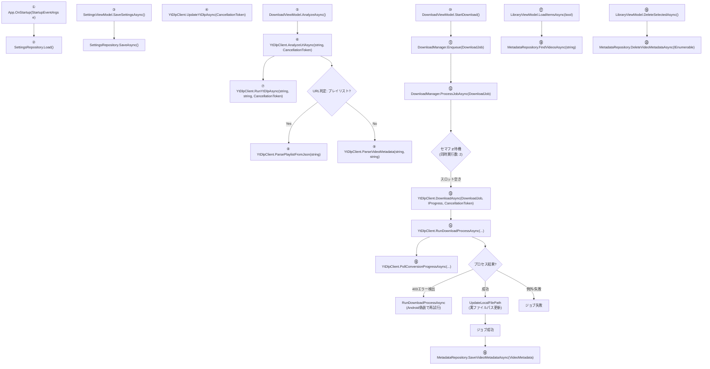
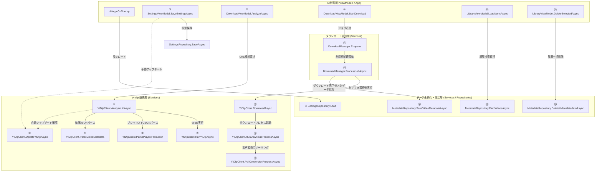

# YouTubeダウンロードアプリ プロジェクト処理フロー

このドキュメントでは、本プロジェクト全体の処理フローおよび主要な関数単位の詳細仕様について、2段階で説明します。

---

## 第1段階：全体俯瞰のフローチャート

以下は、アプリケーションの起動、設定管理、URL解析、ダウンロード実行、およびライブラリ履歴操作の処理全体を表したフローチャートです。

---

## 追加：関数同士の相互呼び出し関係（コールグラフ）

以下は、各クラスに定義されている関数（またはメソッド）同士が、どのようにお互いを呼び出して依存しているかを表した相互関係図です。
縦に階層を並べ、上流のUIイベント（ViewModels）から、コアビジネスロジック（Services）、下流の永続化層・外部ツール実行部（Repositories / Clients）への呼び出しの流れを示しています。

---

## 第2段階：関数単位の詳細説明

第1段階のフローチャート内の各ノードに対応する関数の詳細仕様です。

### 1. 起動・設定フェーズ

#### ① [App.OnStartup(StartupEventArgs e)](file:///c:/Users/Rakua/Documents/VScode/C%23/YT-Downloader_GUI/YouTubeDownloader/App.xaml.cs#L50)
- **役割**: WPFアプリケーションの起動イベントハンドラ。DIコンテナから [MainWindow](file:///c:/Users/Rakua/Documents/VScode/C%23/YT-Downloader_GUI/YouTubeDownloader/MainWindow.xaml.cs#L9) を解決し、画面を表示する。
- **入力**: `StartupEventArgs e`
- **出力**: `void`
- **処理の流れ**:
  - 1. `base.OnStartup(e)` を呼び出す。
  - 2. DIコンテナ (`_serviceProvider`) から `MainWindow` のインスタンスを取得。
  - 3. `mainWindow.Show()` を呼び出してGUIを表示。
- **分岐・例外時の挙動**: 起動時に依存サービスの解決に失敗した場合、`InvalidOperationException` が発生してアプリケーションが異常終了する。

#### ② [SettingsRepository.Load()](file:///c:/Users/Rakua/Documents/VScode/C%23/YT-Downloader_GUI/YouTubeDownloader/Services/SettingsRepository.cs#L41)
- **役割**: 設定ファイル `settings.json` から [AppSettings](file:///c:/Users/Rakua/Documents/VScode/C%23/YT-Downloader_GUI/YouTubeDownloader/Models/AppSettings.cs#L9) を読み込む。
- **入力**: なし
- **出力**: `AppSettings`（デシライズされた設定オブジェクト）
- **処理の流れ**:
  - 1. 設定ファイルパス（`%LocalAppData%\YouTubeDownloader\settings.json`）の存在を確認する。
  - 2. ファイルが存在する場合は `File.ReadAllText` でテキストデータを取得。
  - 3. `JsonSerializer.Deserialize` でデシリアライズしてオブジェクトを返却する。
- **分岐・例外時の挙動**: ファイルが存在しない、または読み込み・デシリアライズに失敗した場合は、例外をキャッチしてデフォルト値で生成された新しい `AppSettings` を安全に返却する。

#### ③ [SettingsViewModel.SaveSettingsAsync()](file:///c:/Users/Rakua/Documents/VScode/C%23/YT-Downloader_GUI/YouTubeDownloader/ViewModels/SettingsViewModel.cs#L158)
- **役割**: UI上でユーザーが変更した設定値を [AppSettings](file:///c:/Users/Rakua/Documents/VScode/C%23/YT-Downloader_GUI/YouTubeDownloader/Models/AppSettings.cs#L9) へ転記し、非同期でファイルへ保存する。
- **入力**: なし
- **出力**: `Task`
- **処理の流れ**:
  - 1. ViewModel内の各プロパティ（yt-dlpパス、ffmpegパス、自動更新有無、既定保存先など）をメンバ変数 `_settings` に転記。
  - 2. `_settingsRepository.SaveAsync(_settings)` を非同期で呼び出す。
  - 3. 保存完了後、`MessageBox.Show` で保存完了メッセージを提示。
- **分岐・例外時の挙動**: 保存ファイル書き込み中の例外等はキャッチされず呼び出し元へ伝播する。

#### ④ [YtDlpClient.UpdateYtDlpAsync(CancellationToken cancellationToken)](file:///c:/Users/Rakua/Documents/VScode/C%23/YT-Downloader_GUI/YouTubeDownloader/Services/YtDlpClient.cs#L922)
- **役割**: yt-dlpの実行ファイルを最新バージョンにアップデートする。
- **入力**: `CancellationToken cancellationToken = default`
- **出力**: `Task<YtDlpUpdateResult>`
- **処理の流れ**:
  - 1. `GetYtDlpPath()` を呼び出して、対象の `yt-dlp.exe` のパスを特定。
  - 2. `_ytDlpUpdateLock` (SemaphoreSlim) を用いてスレッドの排他制御を行い、重複更新を防ぐ。
  - 3. `RunYtDlpUpdateAsync` を呼び出し、yt-dlpに `-U` オプションを指定して非同期実行。
  - 4. 結果出力をパースし、更新結果（最新、更新完了、失敗）を格納した `YtDlpUpdateResult` を返却する。
- **分岐・例外時の挙動**: トークンキャンセル時は処理を中断。プロセス異常終了時はエラー状態の `YtDlpUpdateResult` を返す。

---

### 2. 解析フェーズ

#### ⑤ [DownloadViewModel.AnalyzeAsync()](file:///c:/Users/Rakua/Documents/VScode/C%23/YT-Downloader_GUI/YouTubeDownloader/ViewModels/DownloadViewModel.cs#L163)
- **役割**: 画面で入力されたURLの解析要求を受けて、解析結果のプレビューおよびプレイリスト項目を構築する。
- **入力**: なし（ViewModel の `InputUrl` プロパティを参照）
- **出力**: `Task`
- **処理の流れ**:
  - 1. `InputUrl` が空白の場合は警告を表示して早期リターン。
  - 2. `IsAnalyzing = true` でビジー状態をUIへ通知し、解析結果を初期化。
  - 3. `_ytDlpClient.AnalyzeUrlAsync(InputUrl)` を非同期実行。
  - 4. 解析成功時、プレイリストであれば `PlaylistItems` に動画を格納し `IsPlaylist = true`。単一動画なら動画情報を表示用プロパティに直接バインド。
  - 5. `HasAnalyzedResult = true` でプレビューUIを活性化。
- **分岐・例外時の挙動**: 解析中にエラー（`IsSuccess = false`）または例外が発生した場合は、メッセージボックスでエラーを提示してビジー状態を解除する。

#### ⑥ [YtDlpClient.AnalyzeUrlAsync(string url, CancellationToken cancellationToken)](file:///c:/Users/Rakua/Documents/VScode/C%23/YT-Downloader_GUI/YouTubeDownloader/Services/YtDlpClient.cs#L94)
- **役割**: 指定されたURLを判定し、yt-dlpを用いて非同期で動画／プレイリスト情報のJSONデータを抽出・解析する。
- **入力**: `string url`, `CancellationToken cancellationToken = default`
- **出力**: `Task<YtDlpAnalyzeResult>`
- **処理の流れ**:
  - 1. `GetYtDlpPath()` を通して実行パスを確認し、必要に応じて `EnsureYtDlpUpdatedAsync()` で自動更新を行う。
  - 2. URLに `list=` もしくは `/playlist` が含まれるかを判定。
  - 3. **プレイリストの場合**: `--flat-playlist --dump-single-json` オプションを指定し、`RunYtDlpAsync()` を実行してフラットなJSONを取得。`ParsePlaylistFromJson()` を通してマッピング。
  - 4. **単一動画の場合**: `--dump-json --no-playlist` オプションを指定し、`RunYtDlpAsync()` を実行して詳細なJSONを取得。`ParseVideoMetadata()` を通してマッピング。
- **分岐・例外時の挙動**: yt-dlpの実行ファイルが検知できない場合は `InvalidOperationException` をスロー。実行時エラーや例外発生時は、エラーメッセージを付与した失敗状態の `YtDlpAnalyzeResult` を返却する。

#### ⑦ [YtDlpClient.RunYtDlpAsync(string ytDlpPath, string arguments, CancellationToken cancellationToken)](file:///c:/Users/Rakua/Documents/VScode/C%23/YT-Downloader_GUI/YouTubeDownloader/Services/YtDlpClient.cs#L1121)
- **役割**: 指定された引数で yt-dlp のプロセスを非同期で実行し、標準出力を文字列として取得する。
- **入力**: `string ytDlpPath`, `string arguments`, `CancellationToken cancellationToken`
- **出力**: `Task<string>`
- **処理の流れ**:
  - 1. `ProcessStartInfo` を生成（ウィンドウ非表示、標準出力/標準エラー出力をリダイレクト、UTF-8指定）。
  - 2. プロセスを起動。
  - 3. `StandardOutput.ReadToEndAsync` と `StandardError.ReadToEndAsync` を同時に待機（パイプバッファの詰まりによるハングを防止）。
  - 4. `WaitForExitAsync` でプロセスの完全終了を待ち、標準出力を返す。
- **分岐・例外時の挙動**: トークンにより処理がキャンセルされた場合はタスクを終了し、プロセスを破棄する。

#### ⑧ [YtDlpClient.ParsePlaylistFromJson(string json)](file:///c:/Users/Rakua/Documents/VScode/C%23/YT-Downloader_GUI/YouTubeDownloader/Services/YtDlpClient.cs#L148)
- **役割**: yt-dlp からダンプされたプレイリストのJSONデータを解析し、[PlaylistMetadata](file:///c:/Users/Rakua/Documents/VScode/C%23/YT-Downloader_GUI/YouTubeDownloader/Models/PlaylistMetadata.cs#L8) オブジェクトにマッピングする。
- **入力**: `string json`
- **出力**: `YtDlpAnalyzeResult`
- **処理の流れ**:
  - 1. `JsonDocument.Parse` でJSON文字列を解析。
  - 2. プレイリスト自体のID、タイトル、アップローダー、サムネイルを取得して `PlaylistMetadata` を初期化。
  - 3. 配下の `entries` 配列を走査し、各動画エントリからタイトルやID等を抽出し [VideoMetadata](file:///c:/Users/Rakua/Documents/VScode/C%23/YT-Downloader_GUI/YouTubeDownloader/Models/VideoMetadata.cs#L8) を生成してリストへ追加。
  - 4. 成功したデータを内包した `YtDlpAnalyzeResult` を返却。
- **分岐・例外時の挙動**: JSONパース失敗等の例外が発生した場合は、キャッチしてエラー詳細を設定した失敗用の `YtDlpAnalyzeResult` を返す。

#### ⑨ [YtDlpClient.ParseVideoMetadata(string json, string url)](file:///c:/Users/Rakua/Documents/VScode/C%23/YT-Downloader_GUI/YouTubeDownloader/Services/YtDlpClient.cs#L208)
- **役割**: yt-dlp からダンプされた単一動画のJSONデータを解析し、[VideoMetadata](file:///c:/Users/Rakua/Documents/VScode/C%23/YT-Downloader_GUI/YouTubeDownloader/Models/VideoMetadata.cs#L8) オブジェクトにマッピングする。
- **入力**: `string json`, `string url`
- **出力**: `VideoMetadata?`
- **処理の流れ**:
  - 1. `JsonDocument.Parse` でJSON文字列を解析。
  - 2. アップロード日（`upload_date`）を取得し、`yyyyMMdd` 形式から `DateTime` オブジェクトへパース。
  - 3. タイトル、チャンネル名、秒単位の動画長、サムネイル、URL等の主要プロパティを抽出し、`VideoMetadata` オブジェクトを構築して返す。
- **分岐・例外時の挙動**: JSONのフォーマット違反やパース失敗時には例外をキャッチして `null` を安全に返却する。

---

### 3. ダウンロード実行フェーズ

#### ⑩ [DownloadViewModel.StartDownload()](file:///c:/Users/Rakua/Documents/VScode/C%23/YT-Downloader_GUI/YouTubeDownloader/ViewModels/DownloadViewModel.cs#L245)
- **役割**: 解析済みの動画情報に基づいて [DownloadJob](file:///c:/Users/Rakua/Documents/VScode/C%23/YT-Downloader_GUI/YouTubeDownloader/Models/DownloadJob.cs#L29) を生成し、[DownloadManager](file:///c:/Users/Rakua/Documents/VScode/C%23/YT-Downloader_GUI/YouTubeDownloader/Services/DownloadManager.cs#L33) の実行キューに登録する。
- **入力**: なし
- **出力**: `void`
- **処理の流れ**:
  - 1. 解析結果および保存先フォルダが正しく指定されているかチェック。不適切な場合は警告ダイアログを表示して終了。
  - 2. 保存先フォルダが存在しない場合はディレクトリを新規作成。
  - 3. **プレイリストの場合**: プレイリスト用のサブフォルダ名を生成。選択されている動画エントリ（`IsSelected == true`）ごとに `DownloadJob` を作成し、キューに追加。
  - 4. **単一動画の場合**: 1件の `DownloadJob` を作成し、キューに追加。
  - 5. UIの `DownloadQueue` に追加すると同時に `_downloadManager.Enqueue(job)` を実行。
  - 6. 入力および解析結果のプレビューデータを画面上からクリアする。
- **分岐・例外時の挙動**: 保存先フォルダの作成に失敗した場合は例外をキャッチし、エラーダイアログを表示してキュー追加を中止する。

#### ⑪ [DownloadManager.Enqueue(DownloadJob job)](file:///c:/Users/Rakua/Documents/VScode/C%23/YT-Downloader_GUI/YouTubeDownloader/Services/DownloadManager.cs#L63)
- **役割**: 指定されたダウンロードジョブを内部の全ジョブ管理リストに追加し、非同期処理の実行を開始する。
- **入力**: `DownloadJob job`
- **出力**: `void`
- **処理の流れ**:
  - 1. 排他制御ロック（`lock (_lock)`）をかけて、マルチスレッド環境下での `_allJobs` リストへの追加を保護する。
  - 2. ジョブステータスを `Pending`（待機中）に設定。
  - 3. `JobStatusChanged` イベントを発火し、UI等へステータス変更を通知。
  - 4. タスク（`ProcessJobAsync(job)`）をファイヤーアンドフォーゲットで非同期に開始させる。
- **分岐・例外時の挙動**: 例外は非同期処理 `ProcessJobAsync` の内部で処理されるため、このメソッドの呼び出し元には影響しない。

#### ⑫ [DownloadManager.ProcessJobAsync(DownloadJob job)](file:///c:/Users/Rakua/Documents/VScode/C%23/YT-Downloader_GUI/YouTubeDownloader/Services/DownloadManager.cs#L76)
- **役割**: 最大同時実行数（セマフォ）を制御しながら非同期でダウンロードを実行し、完了時にメタデータを永続化する。
- **入力**: `DownloadJob job`
- **出力**: `Task`
- **処理の流れ**:
  - 1. `CancellationTokenSource` (cts) を作成し、ジョブIDをキーとして `_cancellationTokens` 辞書にスレッドセーフに保管。
  - 2. 同時実行制御用セマフォ `_semaphore.WaitAsync` を非同期待機。
  - 3. スロット獲得後、ステータスを `Running` (実行中) に変更、開始日時および初期進捗を設定し、UI通知イベントを発火。
  - 4. `Progress<ProgressInfo>` による進捗ハンドラを構成し、yt-dlpの出力をジョブの `Progress` と `StatusMessage` に順次同期。
  - 5. `_ytDlpClient.DownloadAsync(job, progress, cts.Token)` を実行。
  - 6. 正常にダウンロードが完了したら、ステータスを `Completed` に設定。[MetadataRepository](file:///c:/Users/Rakua/Documents/VScode/C%23/YT-Downloader_GUI/YouTubeDownloader/Services/MetadataRepository.cs#L23) を使ってメタデータを非同期で保存。
  - 7. `finally` ブロックにて、トークンの破棄、辞書からの削除、セマフォのリリース（`_semaphore.Release()`）を確実に行う。
- **分岐・例外時の挙動**:
  - `OperationCanceledException`（キャンセル要求）発生時: ステータスを `Canceled` に変更し、UIへ通知。
  - 一般の例外発生時: ステータスを `Failed` に変更し、例外の `Message` をジョブの `ErrorMessage` に記録してUIへ通知。

#### ⑬ [YtDlpClient.DownloadAsync(DownloadJob job, IProgress<ProgressInfo>? progress, CancellationToken cancellationToken)](file:///c:/Users/Rakua/Documents/VScode/C%23/YT-Downloader_GUI/YouTubeDownloader/Services/YtDlpClient.cs#L395)
- **役割**: 保存ディレクトリの作成、出力用テンプレート名および実行引数を構築したうえで、yt-dlp プロセスを用いてダウンロードを実行する。
- **入力**: `DownloadJob job`, `IProgress<ProgressInfo>? progress`, `CancellationToken cancellationToken = default`
- **出力**: `Task`
- **処理の流れ**:
  - 1. `job.VideoMetadata.Url` の有無をバリデーション。
  - 2. `GetYtDlpPath()` を通して実行パスを確認し自動更新。
  - 3. 保存先ディレクトリを作成し、ファイル名テンプレート・フォーマットを定義。
  - 4. 音声変換（mp3/wav等）時に進捗度を正しく取得するための一時進捗ファイルを構成。
  - 5. `BuildDownloadArguments()` でコマンドライン引数を組み立てる。
  - 6. `RunDownloadProcessAsync()` を非同期実行。
  - 7. 実行結果が失敗（ExitCode != 0）であり、かつエラー出力が YouTube 側による 403 エラー（Forbidden）を示している場合、引数を Android クライアント（`android`）でのリトライ用 (`BuildAndroidRetryArguments`) に変換して再試行を実行。
  - 8. ダウンロード成功後、生成された実ファイルの名前を特定し `UpdateLocalFilePath()` でジョブへ保存。
  - 9. `finally` にて一時進捗ファイルを確実に削除する。
- **分岐・例外時の挙動**: 最終的にプロセス実行が失敗した場合は、エラーメッセージを伴う `Exception` をスローしてジョブを失敗させる。

#### ⑭ [YtDlpClient.RunDownloadProcessAsync(...)](file:///c:/Users/Rakua/Documents/VScode/C%23/YT-Downloader_GUI/YouTubeDownloader/Services/YtDlpClient.cs#L627)
- **役割**: yt-dlpの外部プロセスを起動し、その標準出力から進捗データを読み解いてリアルタイムに進捗状況を通知する。
- **入力**:
  - `string ytDlpPath` (実行ファイルパス)
  - `string arguments` (コマンド引数)
  - `IProgress<ProgressInfo>? progress` (進捗インターフェース)
  - `string? conversionProgressFile` (音声変換進捗用の一時ファイルパス)
  - `int durationSeconds` (動画の長さ)
  - `CancellationToken cancellationToken` (キャンセル用トークン)
- **出力**: `Task<(int ExitCode, string StdErr)>`
- **処理の流れ**:
  - 1. プロセスの起動パラメータを構築して起動。キャンセル時に子プロセスを含めて強制終了するイベントを登録。
  - 2. `StandardOutput` から非同期で1行ずつ文字列をロード。
  - 3. 読み取った行に `[ExtractAudio] Destination:` が含まれており、かつ進捗追跡可能（mp3/wav等）な場合、`PollConversionProgressAsync()` を起動して ffmpeg の進捗追跡を開始。
  - 4. それ以外の出力行は `ParseProgressLine(line)` でパーセント、速度、ETAを切り出し、`progress.Report` でUIへ通知。
  - 5. 同時に標準エラー出力を非同期タスクで読み込み、バッファに追記。
  - 6. プロセスの終了を待機し、終了コードと標準エラーの内容をタスク結果として返す。
- **分岐・例外時の挙動**: キャンセル時はプロセスツリー全体を強制終了する。

#### ⑮ [YtDlpClient.PollConversionProgressAsync(...)](file:///c:/Users/Rakua/Documents/VScode/C%23/YT-Downloader_GUI/YouTubeDownloader/Services/YtDlpClient.cs#L739)
- **役割**: 音声変換中（ffmpeg処理中）、ffmpeg が出力する一時進捗ファイルを定期的に読み取って進捗率（％）を計算・報告する。
- **入力**:
  - `string progressFile` (ffmpegが書き出す進行状況ファイルパス)
  - `int durationSeconds` (動画の再生時間)
  - `IProgress<ProgressInfo>? progress` (進捗インターフェース)
  - `CancellationToken cancellationToken`
- **出力**: `Task`
- **処理の流れ**:
  - 1. キャンセルされるまで 300ミリ秒周期のディレイループを走らせる。
  - 2. `ReadFfmpegProgress(progressFile)` を呼び出して、ffmpegが処理した現在の時間（マイクロ秒）を取得。
  - 3. `(現在の処理時間 / 動画の総時間) * 100` で変換進捗％を算出し、`progress.Report` で進捗状況とパーセンテージを通知する。
  - 4. 処理終了（`progress=end`）を検知した場合はループを終了する。
- **分岐・例外時の挙動**: ファイルの読み取り失敗などの一時的な例外は無視し、処理を継続する。キャンセル時は安全にループを脱出する。

#### ⑯ [MetadataRepository.SaveVideoMetadataAsync(VideoMetadata metadata)](file:///c:/Users/Rakua/Documents/VScode/C%23/YT-Downloader_GUI/YouTubeDownloader/Services/MetadataRepository.cs#L72)
- **役割**: ダウンロードが完了した動画のメタデータをメモリ上のキャッシュへ追加し、かつ `metadata.json` に書き込んで保存する。
- **入力**: `VideoMetadata metadata`
- **出力**: `Task`
- **処理の流れ**:
  - 1. マルチスレッドからの同時アクセスから保護するため、`_mutex.WaitAsync()` でスレッドの排他制御を実行。
  - 2. キャッシュの読み込みがまだ行われていない場合は `LoadIfNeededAsync()` でファイルをロードしてメモリに展開。
  - 3. メモリ内のリストに既に同じ動画IDが存在する場合は上書き。存在しない場合は新規追加する。
  - 4. キャッシュ内のリスト全体を `JsonSerializer.Serialize` を用いてシリアライズし、非同期でファイルに保存。
  - 5. `finally` ブロックで確実に `_mutex.Release()` を実行。
- **分岐・例外時の挙動**: 保存先フォルダが存在しない場合は自動でディレクトリを作成。ファイル書き込み中にI/Oエラーが発生した場合は呼び出し元に例外をそのまま投げる。

---

### 4. ライブラリ管理フェーズ

#### ⑰ [LibraryViewModel.LoadItemsAsync(bool showBusy)](file:///c:/Users/Rakua/Documents/VScode/C%23/YT-Downloader_GUI/YouTubeDownloader/ViewModels/LibraryViewModel.cs#L119)
- **役割**: 保存されているメタデータからダウンロードされた動画の一覧をロードし、UIの一覧リストを更新する。
- **入力**: `bool showBusy` (読み込み中を示すビジーUIを表示するかどうか)
- **出力**: `Task`
- **処理の流れ**:
  - 1. 既に読み込み処理が進行中（`_isLoading == true`）の場合は、処理終了後に再度ロードを行うよう予約（`_pendingReload = true`）して早期リターン。
  - 2. `showBusy` が true の場合、`IsBusy = true` でUI上にインジケータ等を表示。
  - 3. `_metadataRepository.FindVideosAsync(SearchQuery)` を呼び出し、現在の検索条件に合うデータを非同期で取得。
  - 4. UIリストの登録イベントを抑制しながら一覧をクリアし、取得したデータを `VideoMetadataViewModel` として UI リスト `Items` に登録する。
  - 5. `finally` ブロックで `IsBusy` の解除、読み込み中フラグをオフにし、ロード予約がある場合は再実行する。
- **分岐・例外時の挙動**: 読み込み中のエラーは呼び出し元に伝わるが、`finally` でビジー状態およびロードフラグは安全にクリアされる。

#### ⑱ [MetadataRepository.FindVideosAsync(string? searchQuery)](file:///c:/Users/Rakua/Documents/VScode/C%23/YT-Downloader_GUI/YouTubeDownloader/Services/MetadataRepository.cs#L97)
- **役割**: メモリキャッシュから、検索条件に一致する動画メタデータの一覧を取得する。
- **入力**: `string? searchQuery` (検索用の部分一致文字列)
- **出力**: `Task<IEnumerable<VideoMetadata>>`
- **処理の流れ**:
  - 1. `_mutex.WaitAsync()` を呼び出して排他制御。
  - 2. キャッシュのロードが行われていない場合はファイルを読み込む。
  - 3. `searchQuery` が有効な文字列であれば、動画のタイトル（`Title`）もしくはチャンネル名（`Channel`）に大文字小文字を区別せず部分一致する項目を抽出。
  - 4. ダウンロード日時の降順 (`OrderByDescending(v => v.DownloadedAt)`) にソートしてリスト化し返却。
  - 5. `finally` で `_mutex.Release()`。
- **分岐・例外時の挙動**: ファイル読み込みで例外が発生した場合は、空のキャッシュリストが初期値としてロードされ、検索結果は空になる。

#### ⑲ [LibraryViewModel.DeleteSelectedAsync()](file:///c:/Users/Rakua/Documents/VScode/C%23/YT-Downloader_GUI/YouTubeDownloader/ViewModels/LibraryViewModel.cs#L170)
- **役割**: UI上で選択（チェック）されている動画メタデータを、ユーザーの確認を経て履歴から一括削除する。
- **入力**: なし
- **出力**: `Task`
- **処理の流れ**:
  - 1. `Items` リストから `IsSelected` が true の項目のみを抽出。対象が 0 件なら早期終了。
  - 2. 確認用メッセージボックスを表示。
  - 3. ユーザーが「はい」を選択した場合、`_metadataRepository.DeleteVideoMetadataAsync(targets)` を非同期で呼び出して一括でファイル履歴から削除。
  - 4. メモリ上の UI リスト `Items` からも選択されていた項目を取り除く。
- **分岐・例外時の挙動**: 確認メッセージに対して「いいえ」を選んだ場合は、削除を行わずに終了する。

#### ⑳ [MetadataRepository.DeleteVideoMetadataAsync(IEnumerable<string> videoIds)](file:///c:/Users/Rakua/Documents/VScode/C%23/YT-Downloader_GUI/YouTubeDownloader/Services/MetadataRepository.cs#L135)
- **役割**: メモリキャッシュから引数に合致する動画IDのデータを一括で取り除き、`metadata.json` ファイルを更新する。
- **入力**: `IEnumerable<string> videoIds` (削除対象の動画IDリスト)
- **出力**: `Task`
- **処理の流れ**:
  - 1. 対象のIDリストが空の場合は早期リターン。
  - 2. `_mutex.WaitAsync()` でロック。
  - 3. キャッシュリストから、引数に含まれるすべての動画IDと一致するエントリを取り除く（`_cache.RemoveAll`）。
  - 4. 実際に削除が行われた場合のみ、キャッシュリストをシリアライズして `metadata.json` へ非同期書き込み。
  - 5. `finally` でロックを解放（`_mutex.Release()`）。
- **分岐・例外時の挙動**: 保存時のI/Oエラーが発生した場合は例外をスロー。
